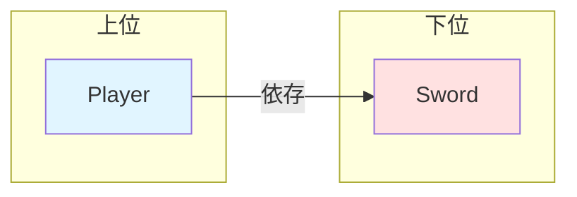
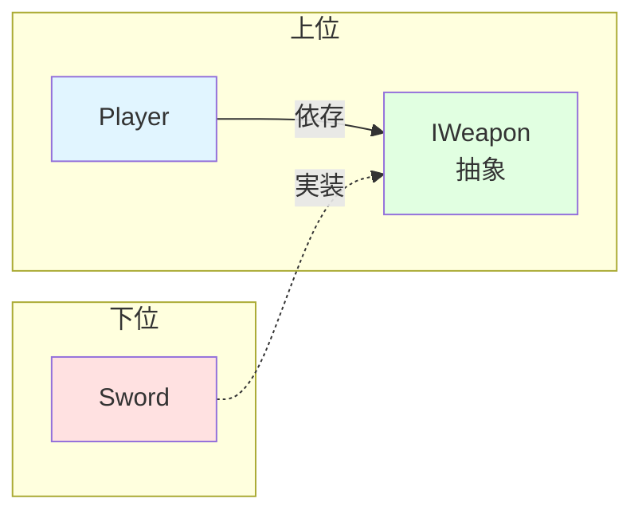
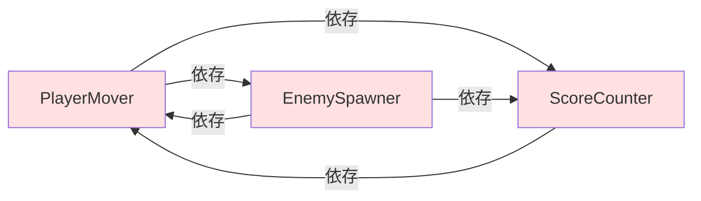
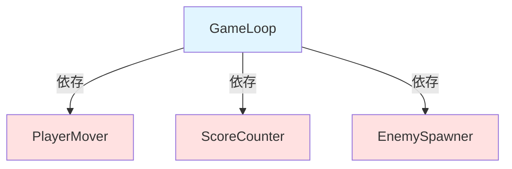
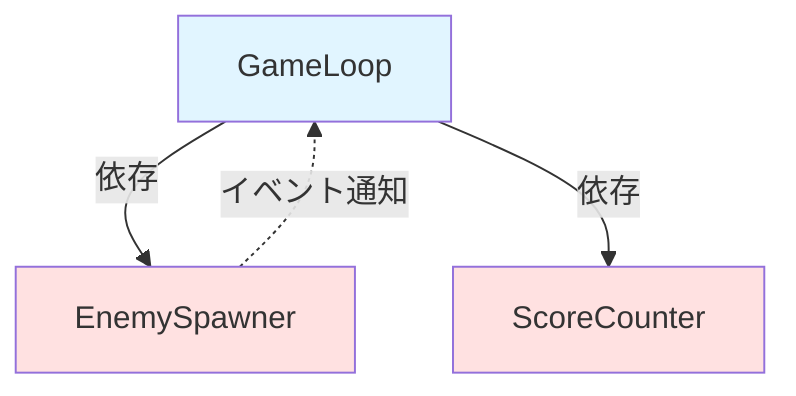
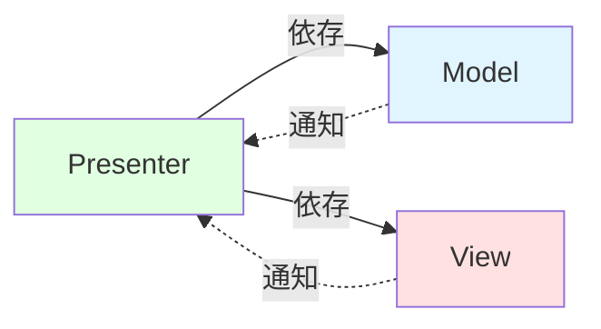
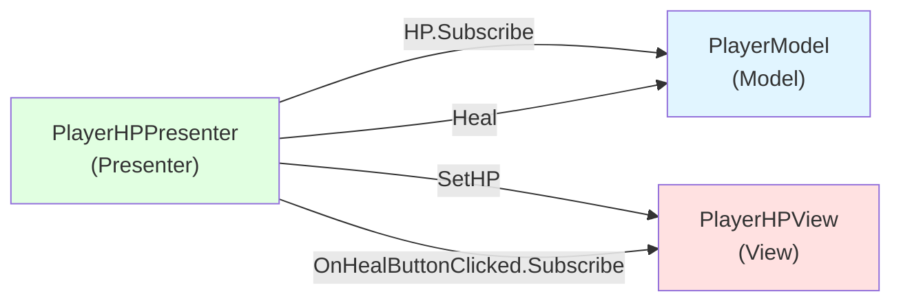

# Unity設計講習会 第2回 「クラス設計」

## 今回の内容

今回はクラス設計を扱います。クラス単位でコードを観察し、それらの関係性をどのように設計するかを解説します。まずSOLID原則などの必要な知識について確認し、次に実際にどのようにして神クラスを保守性が高いように再設計するかについて順番に解説します。

## 1. 設計とは何か

設計とは、クラスの構成やコンポーネントの関係、全体のアーキテクチャなど、何をどう作っていくかの方針やルールを定めたものです。

設計の例えとして、家の建築がよく挙げられます。家を建てるとき、設計無しにただ好きなように部屋や廊下を組み合わせてしまっては家として正しい形にはなりません。まず最初に家全体の形を決め、様々な制約に基づいて間取りや配線、配管などを決めていくことで、初めて家としてその役割を果たすものが完成します。ソフトウェアも同じで、コードを書く前にクラスの責務や関係を整理し、全体の方針を決めることで破綻を防ぎます。

設計の目的は、システムの開発・保守・運用にかかるコストを最小限にすることです。早い話が、クソコードに振り回されずに開発や仕様変更ができるようにすることです。しかしここで難しいのが、設計には万能の正解が存在しないということです。

> 銀の弾丸などない
>
> (No Silver Bullet)
>
> Frederick Brooks

設計のどんな手法にも必ずメリットとデメリットが存在します。なので、我々はそれを自分のプロジェクトに合わせて柔軟に取捨選択することが求められます。例えば、春ハッカソンの30時間のためにゴリゴリにハイレベルな設計をしたところで、大した利益は得られないばかりか、設計がメンバーの手に負えず開発は頓挫するでしょう。それよりは、多少汚くても一気にガッと作ってしまう方が合理的です。

しかしだからといって設計を捨てていいわけではありません。設計を捨てて得られる短期的な開発速度は、直後に訪れる莫大な保守コストに押し潰されます。ここで言いたいのは、あくまで状況に応じて開発コストを最小限にする設計をしろということです。何も考えずに設計を捨てるのと、あえて低レベルな設計を採る判断をするのとでは雲泥の差です。

設計を死守するのが我々開発者の使命です。安易に設計を捨てるという選択を取らないようにしましょう。

## 2. 依存・結合とは

クラス設計において基礎的な概念である依存と結合について改めて確認します。

### 依存

クラスAがクラスBの機能を使わないと仕事ができないとき、AはBに依存しているといいます。コードで言えば、AがBの型を参照している、Bのメソッドを呼んでいる、Bのインスタンスを持っている、これらは全てAがBに依存している状態です。

```csharp=
// PlayerはSwordが無いと攻撃できない → PlayerはSwordに依存している（Player → Sword）
public class Player
{
    Sword sword = new();

    public void Attack()
    {
        sword.Slash();
    }
}

// SwordはPlayerのことを知らない → SwordはPlayerに依存していない
public class Sword
{
    public void Slash() { /* 斬撃 */ }
}
```

依存の怖いところは、変更の波及です。Bに変更が入ると、Bに依存しているAも影響を受け、修正を余儀なくされる可能性があります。依存先が多いほど、また依存が強いほど、一つの変更が広範囲に波及して修正コストが膨れ上がります。

### 結合

どの程度依存しているのかという関係性を表すのが結合です。依存先のクラスの内部事情、すなわちフィールドやメソッドの中身などを知っており、その知識ありきでコードを書いていればそれだけ結合は強くなります。結合が強い状態を密結合といい、逆に結合が弱い状態を疎結合といいます。

```csharp=
// ❌ Bad: 密結合 — PlayerがSwordの内部事情をガッツリ知っている
public class Player
{
    Sword sword = new();

    public void Attack(Enemy enemy)
    {
        // Swordの「攻撃力は基礎値×強化レベル」という内部計算を外からやっている
        int damage = sword.basePower * sword.enhanceLevel;
        // Swordの「耐久度が0以下だと壊れる」という内部ルールも外から管理
        sword.durability--;
        if (sword.durability <= 0)
        {
            sword.isBroken = true;
        }
        enemy.TakeDamage(damage);
    }
}

public class Sword
{
    public int basePower = 10;
    public int enhanceLevel = 1;
    public int durability = 100;
    public bool isBroken = false;
}
// → Swordのフィールド名を1つ変えるだけでPlayerも修正が必要
// → Swordのダメージ計算式を変えたらPlayerも修正が必要
// → Swordの耐久ルールを変えたらPlayerも修正が必要
// → 全部Swordの話なのに、なぜPlayerを修正しなくてはいけないのか？
```

一般に、結合は弱ければ弱いほど良いとされています。結合が強ければそれだけ依存先のクラスの内部事情に左右され、依存先のクラスが少し変更されただけでも、その影響を受けコードを修正しなくてはいけなくなります。

```csharp=
// ✅ Good: 疎結合 — PlayerはSwordの内部事情を知らない
public class Player
{
    Sword sword = new();

    public void Attack(Enemy enemy)
    {
        // 「ダメージを計算する」「耐久度を減らす」という詳細はSwordに任せる
        int damage = sword.CalculateDamage();
        sword.Use();
        enemy.TakeDamage(damage);
    }
}

public class Sword
{
    int basePower = 10;
    int enhanceLevel = 1;
    int durability = 100;

    public int CalculateDamage() => basePower * enhanceLevel;

    public void Use()
    {
        durability--;
    }

    public bool IsBroken => durability <= 0;
}
// → ダメージ計算式が変わってもSwordだけ修正すれば済む
// → 耐久度のルールが変わってもSwordだけ修正すれば済む
// → PlayerはSwordの「何ができるか」だけ知っていればいい
```

より疎結合な状態にするには、間にインターフェースなどの抽象を挟み、その抽象に依存するようにすることです。こうすれば、依存先の具体的なクラスを差し替えても、呼び出し側は一切変更する必要がありません。

```csharp=
// ✅ Better: インターフェースを挟んでさらに疎結合に
public interface IWeapon
{
    int CalculateDamage();
    void Use();
    bool IsBroken { get; }
}

public class Player
{
    IWeapon weapon;

    public Player(IWeapon weapon)
    {
        this.weapon = weapon;
    }

    public void Attack(Enemy enemy)
    {
        int damage = weapon.CalculateDamage();
        weapon.Use();
        enemy.TakeDamage(damage);
    }
}

// SwordもBowもIWeaponを実装するだけでPlayerにそのまま渡せる
public class Sword : IWeapon
{
    int basePower = 10;
    int enhanceLevel = 1;
    int durability = 100;

    public int CalculateDamage() => basePower * enhanceLevel;
    public void Use() => durability--;
    public bool IsBroken => durability <= 0;
}

public class Bow : IWeapon
{
    int power = 8;
    int arrowCount = 30;

    public int CalculateDamage() => power;
    public void Use() => arrowCount--;
    public bool IsBroken => arrowCount <= 0;
}
// → 新しい武器を追加したい？ IWeaponを実装するクラスを作るだけ
// → Playerのコードは一行も変更しなくていい
// → PlayerはSwordやBowの存在すら知らない
```

ただし、何でもかんでもインターフェースを挟んで疎結合にするのは現実的ではありません。過度な抽象化は冗長になり、かえって保守性が下がってしまいます。疎結合化によるメリットとそれによって生じるコストとのバランスを保つことが重要です。

### 相互依存

依存の中でも特に危険なのが**相互依存**です。相互依存とは、クラスAがクラスBに依存し、同時にクラスBもクラスAに依存している状態のことです。これは絶対に避けましょう。相互依存が厄介な理由は、変更の影響が双方向に波及するということです。AをいじればBが壊れ、Bを直せばAが壊れ…と、まるで無限ループに陥る可能性があります。ロジックとしても下手で、動作がとても追いにくいです。依存の方向は絶対に一方通行にしましょう。どうしても相互依存が直せないなら、クラスに統合しましょう。

```csharp=
// ❌ Bad: 相互依存 — PlayerとEnemyがお互いを参照し合っている
public class Player : MonoBehaviour
{
    [SerializeField] Enemy enemy; // インスペクターから注入

    public int hp = 100;

    void Update()
    {
        // 敵が近くにいたら攻撃
        if (Vector3.Distance(transform.position, enemy.transform.position) < 2f)
        {
            enemy.TakeDamage(10);
        }
    }

    public void TakeDamage(int damage)
    {
        hp -= damage;
        if (hp <= 0)
        {
            // 死亡時、敵にも通知
            enemy.OnPlayerDied();
            Destroy(gameObject);
        }
    }
}

public class Enemy : MonoBehaviour
{
    [SerializeField] Player player; // インスペクターから注入

    public int hp = 50;

    void Update()
    {
        // プレイヤーを追いかける
        transform.position = Vector3.MoveTowards(
            transform.position,
            player.transform.position,
            2f * Time.deltaTime
        );

        // プレイヤーが近くにいたら攻撃
        if (Vector3.Distance(transform.position, player.transform.position) < 1.5f)
        {
            player.TakeDamage(5);
        }
    }

    public void TakeDamage(int damage)
    {
        hp -= damage;
        if (hp <= 0)
        {
            Destroy(gameObject);
        }
    }

    public void OnPlayerDied()
    {
        // プレイヤーが死んだら追跡をやめる（ここでは簡略化のため何もしない）
    }
}
// → PlayerもEnemyも、お互いのインスタンスをインスペクターから注入しないといけない
// → Playerを修正するとEnemyが壊れ、Enemyを修正するとPlayerが壊れる
// → どちらか一方だけをテストすることが不可能
// → 循環参照で初期化順序の問題も起きやすい
```

## 3. SOLID原則とは

クラス設計を考えるうえで最も有名な指針であるSOLID原則について確認します。SOLID原則はOOPにおける5つの原則の頭文字をとったものです。

| 頭文字 | 原則名                           | 概要                                       |
| :----: | :------------------------------- | :----------------------------------------- |
|   S    | 単一責任の原則 (SRP)             | クラスの変更理由はただ1つであるべき        |
|   O    | 開放閉鎖の原則 (OCP)             | 拡張に対して開き、修正に対して閉じるべき   |
|   L    | リスコフの置換原則 (LSP)         | 派生型は基本型と置換可能であるべき         |
|   I    | インターフェース分離の原則 (ISP) | 使わないメソッドへの依存を強制すべきでない |
|   D    | 依存性逆転の原則 (DIP)           | 上位は下位の具体に依存すべきでない         |

### S: 単一責任の原則 (Single Responsibility Principle)

> クラスに変更を加える理由は、ただ1つでなければならない
>
> (A class should have one, and only one, reason to change.)
>
> Robert C. Martin

変更理由が一つとは、つまりクラスが持つ責務が一つだけであるということです。ソフトウェアにおける責務とは、「ある関心事について、不正な動作にならないよう、正常に動作するよう制御する任務」です。もし一つのクラスが複数の責務を持っていると、ある責務に関する修正が別の責務にまで影響を及ぼすリスクがあります。また、複数の関心事が入り混じることで可読性も落ち、そのクラスが何をしているのか把握しづらくなります。

そこで、責務ごとにクラスを分割します。そうすることで、片方の変更がもう片方に影響するリスクがなくなり、読みやすくなります。

### O: 開放閉鎖の原則 (Open-Closed Principle)

> ソフトウェアの構成要素は、拡張に対して開いていて、修正に対して閉じていなければならない
>
> (Software entities should be open for extension, but closed for modification.)
>
> Bertrand Meyer

「拡張に対して開いている」とは新しい機能を追加できること、「修正に対して閉じている」とは既存のコードを変更しなくてよいということです。つまり、新機能を追加する際には、理想的にはコードの修正ではなく追加によって行えるようにするべきということです。

ここで活躍するのがインターフェースです。第1回で紹介したStrategyパターンのように、インターフェースによって処理を抽象化すれば機能追加をクラスの追加によって行うことができます。

```csharp=
// ❌ Bad: 新しい敵を追加するたびにif文を修正する必要がある
public class EnemySpawner : MonoBehaviour
{
    public void SpawnEnemy(string type)
    {
        if (type == "Slime")
        {
            // スライム生成
        }
        else if (type == "Goblin")
        {
            // ゴブリン生成
        }
        // 新しい敵を追加するたびにここを修正
    }
}
```

```csharp=
// ✅ Good: 新しい敵はクラスを追加するだけで対応できる
public interface IEnemy { void Initialize(); }

public class Slime : IEnemy { public void Initialize() { /* 初期化 */ } }
public class Goblin : IEnemy { public void Initialize() { /* 初期化 */ } }

public class EnemySpawner : MonoBehaviour
{
    public void SpawnEnemy(IEnemy enemy)
    {
        enemy.Initialize();
        // 新しい敵を追加してもこのコードは変更不要
    }
}
```

### L: リスコフの置換原則 (Liskov Substitution Principle)

> 派生型はその基本型と置換可能でなければならない
>
> (Subtypes must be substitutable for their base types.)
>
> Barbara Liskov, Jeannette Wing

これは継承を行う際の原則です。これが言っているのは、親クラスが使われている場所に子クラスを入れても、プログラムが正しく動かなければならないということです。

継承は、is-a関係（「〜は〜の一種である」）が成り立つ場合に行うものです。これが成り立たない場合は継承よりもインターフェースや委譲を検討しましょう。

```csharp=
// ❌ Bad: 親クラスで成立する契約を子クラスが破っている
public class Bird
{
    public virtual void Fly() { /* 飛ぶ */ }
}

public class Penguin : Bird
{
    public override void Fly()
    {
        throw new Exception("ペンギンは飛べません！");
    }
}

void UseBird(Bird bird)
{
    bird.Fly(); // Penguinだと例外が発生 — 親と子で動作が異なる
}
```

```csharp=
// ✅ Good: 飛べる鳥と飛べない鳥を区別する
public interface IBird { void Move(); }
public interface IFlyable { void Fly(); }

public class Sparrow : IBird, IFlyable
{
    public void Move() { /* 移動 */ }
    public void Fly() { /* 飛ぶ */ }
}

public class Penguin : IBird
{
    public void Move() { /* 移動 */ }
    // Flyは実装しない
}

void UseFlyable(IFlyable flyable)
{
    flyable.Fly(); // IFlyableなら必ず飛べる
}
```

### I: インターフェース分離の原則 (Interface Segregation Principle)

> クライアントが使わないメソッドへの依存を強制してはならない
>
> (Clients should not be forced to depend upon interfaces that they do not use.)
>
> Robert C. Martin

インターフェースを作るのが面倒だからといって、一つの巨大なインターフェースにあらゆる機能を詰め込んではいけません。使いもしない実装を書かなくてはいけなくなるばかりか、それによって誤って不正な動作をしてしまう危険があります。インターフェースは適切に分割しましょう。

```csharp=
// ❌ Bad: 使わないメソッドまで実装を強制される
public interface ICharacter
{
    void Move();
    void Attack();
    void Fly();
    void Talk();
}

public class Enemy : ICharacter
{
    public void Move() { /* 移動 */ }
    public void Attack() { /* 攻撃 */ }
    public void Fly() { throw new NotImplementedException(); } // 使わないのに実装を強制
    public void Talk() { throw new NotImplementedException(); }
}
```

```csharp=
// ✅ Good: 必要な機能だけを持つインターフェースに分割
public interface IMovable { void Move(); }
public interface IAttackable { void Attack(); }
public interface IFlyable { void Fly(); }
public interface ITalkable { void Talk(); }

public class Enemy : IMovable, IAttackable
{
    public void Move() { /* 移動 */ }
    public void Attack() { /* 攻撃 */ }
}

public class FlyingEnemy : IMovable, IAttackable, IFlyable
{
    public void Move() { /* 移動 */ }
    public void Attack() { /* 攻撃 */ }
    public void Fly() { /* 飛行 */ }
}
```

### D: 依存性逆転の原則 (Dependency Inversion Principle)

SOLID原則において最も重要で、かつ最も理解が難しいのがこの原則です。

> 上位モジュールは下位モジュールに依存してはならない。両者は抽象に依存すべきだ
>
> (High-level modules should not depend on low-level modules. Both should depend on abstractions.)
>
> Robert C. Martin

ここでいう上位とは、ゲームの本質的かつ抽象的なルールや方針を定義するもの、下位は、上位が決めたルールを具体的に実装するものです。ここにおいて、上位は本質を表す抽象であるためあまり変更されない、つまり安定しています。しかし下位はより詳細を知るため、頻繁に変更されます。

つまりこの原則は、「安定した本質的なルール（上位）が、変わりやすい具体的な実装（下位）に直接依存するべきではない。両者の間にインターフェースなどの抽象を挟んで、お互いがその抽象に依存するべきだ」と言っているのです。

前に取り上げた密結合/疎結合の例を再び考えてみましょう。ここにおいて、`Player` は「武器を使って攻撃する」という本質的なルールを持つ上位、`Sword` はその「武器」の具体的な実装である下位です。上位である `Player` が下位の `Sword` という具体に直接依存してしまっている状態は、依存性逆転の原則に違反しています。

```csharp=
// ❌ Bad: Player(上位 = 本質的なルール)が、Sword(下位 = 具体的な実装)に直接依存している
public class Player
{
    Sword sword = new();

    public void Attack(Enemy enemy)
    {
        // Swordのメソッドを直接呼び出している
        int damage = sword.CalculateDamage();
        sword.Use();
        enemy.TakeDamage(damage);
    }
}

public class Sword
{
    int basePower = 10;
    int enhanceLevel = 1;
    int durability = 100;

    public int CalculateDamage() => basePower * enhanceLevel;
    public void Use() => durability--;
    public bool IsBroken => durability <= 0;
}
// → Swordを別の武器に変えたい？ Playerのコードを修正する必要がある
// → 新しい武器を追加したい？ Playerのコードを修正する必要がある
```

これは良くない状況です。下位は不安定なので、それに依存している安定なはずの上位も、その変更の影響を強く受けてしまい不安定になります。そこで、間にインターフェースを挟んで疎結合にすることで、この問題を解決できます。

```csharp=
// ✅ Good: インターフェースを挟んで疎結合に
// 「武器」という共通ルール（インターフェース）を定義
public interface IWeapon
{
    int CalculateDamage();
    void Use();
    bool IsBroken { get; }
}

// Player(上位 = 本質的なルール)は、具体的なSwordではなく、抽象的なIWeaponにのみ依存する
public class Player
{
    IWeapon weapon;

    // どんな武器を使うかは、外から与えてもらう（依存性の注入）
    public Player(IWeapon weapon)
    {
        this.weapon = weapon;
    }

    public void Attack(Enemy enemy)
    {
        // 相手が剣か斧かを知らない。ただ「IWeapon」のルールを実行するだけ。
        int damage = weapon.CalculateDamage();
        weapon.Use();
        enemy.TakeDamage(damage);
    }
}

// Swordをそのルールに従って実装する
public class Sword : IWeapon
{
    int basePower = 10;
    int enhanceLevel = 1;
    int durability = 100;

    public int CalculateDamage() => basePower * enhanceLevel;
    public void Use() => durability--;
    public bool IsBroken => durability <= 0;
}

// 新しい武器も簡単に追加できる
public class Bow : IWeapon
{
    int power = 8;
    int arrowCount = 30;

    public int CalculateDamage() => power;
    public void Use() => arrowCount--;
    public bool IsBroken => arrowCount <= 0;
}
// → 新しい武器を追加したい？ IWeaponを実装するクラスを作るだけ
// → Playerのコードは一行も変更しなくていい
```

ここにおいて、`Player` と `Sword` の間に `IWeapon` というインターフェースが挟まり、両者はこれに依存しています。こうすることで疎結合になり、武器を簡単に取り替えることができ、拡張性があり、変更に強く、再利用性の高い設計になります。依存性逆転の原則はこの疎結合化を表した原則なのです。

ところで、依存性逆転の原則といっても何が「逆転」しているのでしょうか。それは依存関係を見ると分かります。まず、原則適用前の依存関係は以下の通りです。



本質的なルールを持つ上位の `Player` が、具体的な実装詳細である下位の `Sword` に依存している状態です。`Sword` の変更が `Player` に波及してしまいます。続いて、原則を適用した後は以下の通りです。



`Player` と `Sword` は共に `IWeapon` に依存しています。ここにおいて、`Player` と `IWeapon` はまとめて上位層としてカウントします。すると、今度は下位の `Sword` が上位に依存している状態になりました。つまり、依存関係が逆転しているのです。このように、抽象を挟むことで依存関係を自由にコントロールする力を与えてくれるのが、依存性逆転の原則なのです。

もちろん、この原則を絶対のものとして守り続けるのは明らかに現実的ではありません。何でもかんでもインターフェースを挟むと、過度な抽象化で冗長になり、かえって保守性が下がってしまいます。大事なのはその費用対効果で、開発コストに対するメリットのバランスを取ることが重要です。

#### よくある間違い

「依存性逆転の原則」でネットで調べると、間違った内容を書いている記事が散見されます。

- ユーザーが触れる部分が上位側である
    - 逆で、ユーザーが触れる部分=Viewは下位です
- 上位は使う側、下位は使われる側である
    - 誤った定義です。下位が上位を使う場面は普通にあります(UseCaseがDomainを使うなど)。本質は抽象か具象かです。
- 原文の「抽象」とは、インターフェースや抽象クラスのことである
    - 誤りです。原文の「抽象」は特定の言語機能を指していません。ここでいう抽象とは概念的なもので、言うなれば「具体的な実装の詳細を含まない安定した契約」のことで、インターフェースはそれを実現する手段の一つに過ぎません。インターフェースを用いても、そこに詳細が混入していれば抽象とは呼べません。
- 依存性逆転の原則は、インターフェースを挟んで依存性を逆転させる原則
    - 誤りとは言えませんが、言葉足らずです。原文が言っている通り、本質は両者を抽象に依存させることです。先程説明したように、インターフェースはそれを実現する手段の一つに過ぎず、単にインターフェースを挟んでも詳細が混じっていれば間違いです。

## 4. 神を殺す

SOLID原則などを学んだところで、早速実践してみましょう。最初にあなたが取り組むべきは、神クラスの抹殺です。

Unity初心者がやりがちなことは、`GameManager` なるクラスを作成し、とにかくゲームの全てをそこに書くということでしょう。あなたも最初はそのようにしていたはずです。そして、それによって非常に苦しい経験をしたこともあると思います。行数は何百、何千と膨れ上がり、手を入れようにもどこを修正すればいいのか分からない。少しコードを変えただけでバグで溢れかえり、新機能を少し追加するだけで日が暮れてしまったことでしょう。

これは明らかに単一責任の原則に違反しています。`GameManager` を見てみると、プレイヤーの移動、スコア管理、敵のスポーン、BGM制御…と、この一つのクラスの中にゲーム全体の責務を抱えていることが分かります。このように、あらゆる責務を持ち、何百行にもなるロジックが複雑に絡み合ったクラスのことを神クラスといいます。あなたがまずするべきことはこの神の抹殺です。

```csharp=
// ❌ Bad: あらゆる責務を詰め込んだ「神クラス」
public class GameManager : MonoBehaviour
{
    // プレイヤーの移動
    [SerializeField] float moveSpeed;
    [SerializeField] Rigidbody playerRb;

    // スコア管理
    int score;
    [SerializeField] Text scoreText;

    // 敵のスポーン
    [SerializeField] GameObject enemyPrefab;
    float spawnTimer;

    // BGM管理
    [SerializeField] AudioSource bgmSource;

    void Update()
    {
        // 移動処理
        float h = Input.GetAxis("Horizontal");
        float v = Input.GetAxis("Vertical");
        playerRb.MovePosition(transform.position + new Vector3(h, 0, v) * moveSpeed * Time.deltaTime);

        // スコア表示更新
        scoreText.text = $"Score: {score}";

        // 敵スポーン処理
        spawnTimer += Time.deltaTime;
        if (spawnTimer > 3f)
        {
            Instantiate(enemyPrefab, GetRandomPosition(), Quaternion.identity);
            spawnTimer = 0;
        }

        // BGM制御
        if (!bgmSource.isPlaying) bgmSource.Play();
    }

    public void AddScore(int amount) { score += amount; scoreText.text = $"Score: {score}"; }
    // ... まだまだ続く ...
}
// → 「移動の仕様を変えたい」だけなのに、スコアやBGMのコードの海を泳がなきゃいけない
```

そこで、責務ごとにクラスを分割し、一つのクラスが一つだけの関心事を扱うようにします。

```csharp=
// ✅ Good: 責務ごとにクラスを分割
public class PlayerMover : MonoBehaviour
{
    [SerializeField] float moveSpeed;
    [SerializeField] Rigidbody rb;

    // 自分ではUpdateしない。外から呼ばれることで動く
    public void Move()
    {
        float h = Input.GetAxis("Horizontal");
        float v = Input.GetAxis("Vertical");
        rb.MovePosition(transform.position + new Vector3(h, 0, v) * moveSpeed * Time.deltaTime);
    }
}

public class ScoreCounter
{
    int score;
    public int Score => score;

    public void AddScore(int amount)
    {
        score += amount;
    }
}

public class EnemySpawner : MonoBehaviour
{
    [SerializeField] GameObject enemyPrefab;
    [SerializeField] float spawnInterval = 3f;
    float spawnTimer;

    // 自分ではUpdateしない。外から呼ばれることで動く
    public void SpawnUpdate()
    {
        spawnTimer += Time.deltaTime;
        if (spawnTimer < spawnInterval) return;

        Instantiate(enemyPrefab, GetRandomPosition(), Quaternion.identity);
        spawnTimer = 0;
    }
}
// → 移動の仕様を変えたい？ PlayerMoverだけ見ればOK！
```

場合によりますが、適切に責務を分割できているクラスは大体100~200行程度に収まります。そのくらいクラス一つ一つは小さなものになります。もちろんこれを超えていると即アウトというわけでも、この行数を目指してコードを書けという訳でもありませんが、目安の一つとして有効です。クラスに単一の責任を与え、小さく、明確に保ちましょう。

## 5. 依存の方向を制御する

神クラスを分割した後は、それによって生まれたクラスたちをどのように組み合わせるかが問題になります。ここで、安易に各クラス同士を参照させてしまうと依存関係がごちゃごちゃになり、せっかく神クラスを分割したのが無意味になります。



ここにおいて、制御フローを意識し、依存の方向が一方向に向くようにすることが重要です。

### 使う側と使われる側を意識する

依存の方向を整理する基本方針はシンプルです。使う側のクラスが使われる側のクラスを知り、使われる側のクラスは使う側のクラスを知らない。これだけです。

ここでいう使う側とは、複数のクラスを束ねて制御フロー全体を指揮するクラスです。使われる側のクラスは命令に従って自分の仕事だけを黙々とこなし、命令したのが誰であるかを知る必要はありません。

先の例でいえば、分割して生まれた `PlayerMover`、`ScoreCounter`、`EnemySpawner` はそれぞれ使われる側のクラスです。そして、それらを束ねてゲームの進行という制御フローを管理するクラスが必要になります。

```csharp=
// ✅ Good: 束ねるクラスが個々のクラスを使う
public class GameLoop : MonoBehaviour
{
    // 束ねる側は個々のクラスを知っている
    [SerializeField] PlayerMover playerMover;
    [SerializeField] EnemySpawner enemySpawner;
    ScoreCounter scoreCounter = new();

    void Start()
    {
        // 束ねる側が制御フローを組み立てる
        enemySpawner.OnEnemyDefeated += HandleEnemyDefeated;
    }

    // GameLoopのUpdateが唯一のエントリーポイント
    void Update()
    {
        playerMover.Move();
        enemySpawner.SpawnUpdate();
    }

    void HandleEnemyDefeated()
    {
        scoreCounter.AddScore(100);
    }
}
```



依存の方向が使う側から使われる側への一方向に揃いました。`PlayerMover`、`ScoreCounter`、`EnemySpawner` はお互いの存在を知りません。それぞれが自分の責務だけに集中し、それらを組み合わせて全体の制御フローを作るのは束ねる側の `GameLoop` の仕事です。このように、使う側と使われる側を意識するだけで依存関係はだいぶ整理されます。

### エントリーポイントを一つにする

プログラムにおいて一番最初に実行される場所、すなわち処理の開始地点のことをエントリーポイントといいます。pythonやC++でいうmain関数のことです。

unity文脈においては、MonoBehaviourの `Start()` や `Update()` などがエントリーポイントに相当します。これらのメソッドはUnityによって自動的に呼び出され、処理を実行する起点となります。

ここにおいて、エントリーポイントはあらゆる場所に置かず、一つの場所に集約するべきです。エントリーポイントは処理の起点であり、他のクラスに叩かれずとも自発的に動くことができます。つまり、あらゆるクラスの中でも一番上の使う側といえます。もしこれが複数存在すると、使う側と使われる側の関係が崩壊し、制御フローや依存関係が乱れてしまいます。「船頭多くして船山に登る」ということです。

エントリーポイントを一つにし、他のクラスはエントリーポイントに叩かれることで処理を行うようにしましょう。

### イベントを活用する

とはいっても、「敵が倒された」「プレイヤーが死んだ」「アイテムを拾った」など、使われる側のクラスから使う側のクラスに何かを通知したい場面は必ず出てきます。しかし使われる側が使う側に通知しようと参照を持ってメソッドを直接呼ぶのは相互依存になってしまいます。

ここで活躍するのがイベントです。イベントとは、ある出来事が発生したときにその発生を通知し、その通知を購読して処理を行う仕組みのことです。

```csharp=
// ✅ Good: イベントで通知する（使われる側は使う側を知らない）
public class EnemySpawner : MonoBehaviour
{
    [SerializeField] GameObject enemyPrefab;

    // 「敵が倒された」ことを通知するイベント
    public event Action OnEnemyDefeated;

    public void ReportEnemyDefeated()
    {
        // 誰が聞いているかは知らない。ただ通知するだけ。
        OnEnemyDefeated?.Invoke();
    }
}

// 束ねるクラスがイベントを購読して制御フローを組み立てる
public class GameLoop : MonoBehaviour
{
    [SerializeField] EnemySpawner enemySpawner;
    ScoreCounter scoreCounter = new();

    void Start()
    {
        // 束ねる側が「敵が倒されたらスコアを加算する」という制御フローを定義
        enemySpawner.OnEnemyDefeated += HandleEnemyDefeated;
    }

    void OnDestroy()
    {
        // オブジェクト破棄時にイベントの購読を解除する
        enemySpawner.OnEnemyDefeated -= HandleEnemyDefeated;
    }

    void HandleEnemyDefeated()
    {
        scoreCounter.AddScore(100);
    }
}
// → EnemySpawnerはScoreCounterの存在すら知らない
// → EnemySpawnerはGameLoopの存在すら知らない
// → 依存の方向は使う側から使われる側への一方通行を維持している
```



ここにおいて、イベントを通知する側は購読する側を知る必要がないという点が重要です。これはSNSに似ています。投稿者は何か出来事があったときにツイートしますが、その投稿を誰が読むか知りません。一方投稿を読みたい人は、垢をフォローするなり通知をつけるなりしてその人の投稿を購読します。もし新規投稿があれば通知され、後はそれに従って各々が反応するだけです。

ちなみに、イベントを購読するときに最も気をつけるべきことが、オブジェクトが破棄されたときなど、不要になったら必ず購読を解除することです。購読はたとえオブジェクトが破棄されても残り続けます。もしそのままだと、破棄済みのオブジェクトのメソッドが呼ばれてエラーが発生してしまいます。例えばMonoBehaviourの場合は `OnDestroy` で解除するのが基本です。

このように、イベントを活用することで依存関係を新たに生むことなく使われる側が使う側に通知することができるようになります。なお、ここでは例としてC#標準のイベントを使用しましたが、後に説明するR3を用いる方が便利でおすすめです。

## 6. 依存性を注入する

クラスを分割して依存の方向を設計するときに問題になるのが、依存するクラスのインスタンスをどうやって取得するか？ということです。要するに、必要な別のクラスにどうやってアクセスするのか、ということです。

最も良い方法は、必要なクラスのフィールドを定義し、`[SerializeField]` 属性をつけてインスペクターから注入してやることです。こうすることで、実際にどのインスタンスを使用するかを知る必要がありません。必要ならテスト用のインスタンスを渡すことだってできます。つまり、疎結合になるのです。

```csharp=
// ✅ Good: [SerializeField] でインスペクターから注入
public class GameLoop : MonoBehaviour
{
    // どのインスタンスを使うかはインスペクターで設定する
    [SerializeField] PlayerMover playerMover;
    [SerializeField] EnemySpawner enemySpawner;

    void Start()
    {
        enemySpawner.OnEnemyDefeated += HandleEnemyDefeated;
    }

    void HandleEnemyDefeated()
    {
        
    }
}
// → GameLoopはインスペクターで設定されたインスタンスを使うだけ
// → どのオブジェクトが注入されるかはGameLoop自身の知ったことではない
```

このように、どのインスタンスに依存するかという依存性の問題の解決を外部に任せ、外部から注入してもらう手法を依存性注入(DI)といいます。

## 7. カプセル化する

あなたは単一責任の原則に基づき神クラスを分割しました。しかし、本当にそうでしょうか？あなたがクラスに閉じ込めたはずの関心事は、実は外に漏れ出てしまっているかもしれません。

### ドメインモデル貧血症

例えば、ゲームのスコアを `Score` というクラスの `Value` というプロパティで管理しているとします。一見すると、スコアという関心事が専用のクラスに切り出されていて良さそうに思えます。しかし実はこれは良くない状況です。

```csharp=
// 一見よさそうだが...
public class Score
{
    public int Value { get; set; }
}
```

では、この状態でスコアを増やしたいときはどうすればいいでしょうか。もしスコアは10点ずつ加算されるというゲームルールだった場合、`score.Value += 10` とでも書くことでしょう。しかしよく考えてください。この状況、おかしくないですか？あなたは単一責任の原則に基づいて、スコアという関心事を `Score` クラスに閉じ込めたはずです。しかし、このままでは「スコアは10点ずつ加算される」というスコアに関する知識が `Score` クラスの外に置かれることになります。関心事が漏れているのです。

```csharp=
// ❌ Bad: スコアのルールがScoreの外に漏れている
score.Value += 10;           // 「10点ずつ加算」というルールがここに書かれている
score.Value = -114514;       // 不正な値もセットし放題！
score.Value = int.MaxValue;  // やりたい放題！
```

もしここでスコアの計算方法が変われば、あなたは `score.Value += 10` とでも書いている箇所を全て探して修正しなくてはいけません。これでは全く安全ではありません。

全ての原因は、`Score` クラスがフィールドとして `Value` を持っておきながらそれを扱うメソッドを持たず、実質的に値を保持するだけのデータクラスになっていることです。自分では何もできないので他のクラスに介護してもらわなければ動けず、他のクラスは不正し放題、関心事は漏れ放題。プロパティを使って玄人気分になっておきながら、実態としては全く無意味なことをしていたのです。このように実質的にただのデータクラスと化している状態のことを、ドメインモデル貧血症といいます。

### 尋ねるな、命じろ

ドメインモデル貧血症を治療する方法は、自分のことは自分でやるようにクラスを修正してやることです。これに関して次のような言葉があります。

> 尋ねるな、命じろ
>
> (Tell, Don't Ask.)
>
> Alec Sharp

この言葉が主張しているのは、クラスのデータを外部が尋ねてクラスの外で計算したり判断するのではなく、その計算や判断をそのデータを持っているクラス自身がやるように命令しなさいということです。

```csharp=
// ❌ Bad: 「データを尋ねて」外部で処理
if (score.Value < maxScore)    // 外部がScoreの値を「尋ねて」
{
    score.Value += 10;          // 外部がスコアのルールを「計算して」
}

// ✅ Good: クラスに「命じる」
score.AddScore();  // 「スコアを加算しろ」と命令するだけ。ルールはScore内部に閉じている
```

```csharp=
// ✅ Good: 自分のことは自分でやる Score クラス
public class Score
{
    public int Value { get; private set; }

    const int ScorePerAction = 10;
    const int MaxScore = 99999;

    public void AddScore()
    {
        Value = Mathf.Min(Value + ScorePerAction, MaxScore);
    }
}
// → スコアのルールが Score に閉じ込められた！
// → 外部は AddScore() を呼ぶだけで、詳細を知る必要がない
```

スコアのルールが `Score` に閉じ込められ、それを利用する外部クラスは `Score` クラスの構造やルールを知っている必要がなくなります。これでスコアのルールが変更されても、`Score` クラスの一箇所を変更するだけで済みます。

### setterは悪だ

先程の例で `Value` のsetterをprivateに変更しました。これは、`AddScore` 以外の方法で値を変更されないようにするためです。これにより関心が外に漏れる心配はなくなりました。このように、第1回でも述べた通り、アクセスレベルは基本的にprivateが前提です。特にsetterに関しては余程のことがない限り公開してはいけません。

それどころか、getterとsetterそのものを悪とする主張もあるくらいです。

> getterとsetterは悪だ
>
> (Getters and Setters Are Evil)
>
> Allen Holub

この主張は未だに議論が絶えません。現実的には、getterは必要になるときがあるため（UIでの表示など）、完全には悪ではありません。悪となり得るのは関心事を外部に流出させている場合です。一方、setterは擁護し難いので私は悪だと思います。publicなsetterを書くときは、本当にそれが必要かを立ち止まって考えてください。恐らく必要ないはずです。

### 知らない人とは話さない

友達の友達の友達に話しかけてはいけません。

```csharp=
// ❌ Bad: 知らない人と話しまくっている
player.GetInventory().GetSlot(0).GetItem().GetEffect().Apply(player);
// →「プレイヤーの持ち物のスロットのアイテムのエフェクトを適用して」
// → Playerの内部 → Inventoryの内部 → Slotの内部 → Itemの内部まで掘り下げている
```

このコードは、`player` の内部構造から `Inventory`、`Slot`、`Item`、`Effect` まで全ての内部構造を知っている前提で書かれています。つまり、知識が外に漏れ出ている状況です。もし `Inventory` の構造が変わったら？ `Slot` が廃止されたら？ このコードを使っている全ての箇所を修正しなければなりません。

これを防ぐ指針がデメテルの法則です。

> 直接の友達とだけ話しなさい
>
> (Only talk to your immediate friends.)
>
> Ian Holland

具体的には、あるメソッドが呼び出してよいのは以下のメソッドだけです。

1. **自分自身**のメソッド
2. **自分のフィールド**のメソッド
3. **引数として渡されたオブジェクト**のメソッド
4. **自分が生成したオブジェクト**のメソッド


```csharp=
// ✅ Good: 必要な操作をクラスのメソッドとして提供する
public class Player
{
    Inventory inventory;

    // Playerに「アイテムを使え」と命令する (Tell, Don't Ask!)
    public void UseItem(int slotIndex)
    {
        inventory.UseItem(slotIndex, this);
    }
}

public class Inventory
{
    List<Slot> slots;

    public void UseItem(int slotIndex, Player player)
    {
        slots[slotIndex].Use(player);
    }
}

// 呼び出し側はPlayerのメソッドだけ呼べばよい
player.UseItem(0);  // 内部構造を知る必要がない！
```

デメテルの法則は、先ほどの「尋ねるな、命じろ」とも深く関係しています。他のオブジェクトの内部構造を尋ねてチェーンを辿る代わりに、やりたいことを直接命じるようにすれば、自然とデメテルの法則も守れます。

### staticおじさんにならない

フィールドをstaticにすると値が各インスタンスで共通になり、更に `public static` にすればインスタンス無しにどこからでも値を取得したり書き換えたりできるようになります。一見便利で簡単なので、初心者は特にこれを使ってしまいがちです。しかし、これは絶対にやってはいけません。

理由はまずドメインモデル貧血症になること。先程説明したように、外から自由に変更できてしまうため、関心がクラスの外にダダ漏れになってしまいます。そして更に酷いことに、`public static` なフィールドはあらゆる場所からアクセス可能です。つまり、関心が漏れ出る範囲が圧倒的に広く、全く関係ない場所からでもアクセスできてしまいます。そうなると制御フローが滅茶苦茶になり、どこからアクセスされどこで値が変わったかの追跡も困難になり、不正な値も書き込まれ放題です。この世の終わりです。

```csharp=
// ❌ Bad: staticおじさんの末路
public class GameData
{
    public static int score;       // どこからでも読み書き自由！
    public static int hp;          // カプセル化？何それ美味しいの？
    public static bool isDead;     // 全部publicでstaticだ！便利！
    public static string playerName;
}

// 全く無関係なクラスからアクセスし放題の地獄絵図
public class ScoreUI : MonoBehaviour
{
    void Update()
    {
        GameData.score += 1;  // UIがスコアを直接書き換えている！？
    }
}

public class Enemy : MonoBehaviour
{
    void OnDestroy()
    {
        GameData.score += 100;   // 敵もスコアを書き換える
        GameData.hp -= 5;        // なぜか敵がプレイヤーのHPをいじっている
        GameData.isDead = true;   // 勝手に殺すな
    }
}

public class TitleScreen : MonoBehaviour
{
    void Start()
    {
        GameData.score = -999;   // タイトル画面からスコアを破壊できる。終わりだ
    }
}
// → 誰がいつどこで値を変えたか追跡不能。バグの温床。
```

なりふり構わずstaticを乱用する愚か者をstaticおじさんと呼びます。オジサンにならないでください。

### 生焼けオブジェクトを作らない

クラスを正しく動作させるために、最初にフィールドなどを初期化する必要がある場合があります。しかしこのとき、インスタンスを生成した後に外から値を個別に代入したりして初期化してはいけません。

これもドメインモデル貧血症と同じ理由です。使う前に外から個別に初期化してやらないといけないということは、自分一人では正しく動作することができないということです。使う前に初期化しないといけないということを外のクラスが知る必要がありますし、もしこれを忘れれば、初期化前の不正状態のフィールドにアクセスすることになり、バグが発生します。このようなオブジェクトを生焼けオブジェクトといいます。

```csharp=
// ❌ Bad: 生焼けオブジェクト
public class Weapon
{
    public string Name;
    public int Attack;
    public float Range;

    public void PrintInfo()
    {
        Debug.Log($"{Name}: ATK={Attack}, Range={Range}");
    }
}

// 使う側はこう書かないといけない
var weapon = new Weapon();    // この時点では全て初期値（null, 0, 0）→ 生焼け！
weapon.Name = "Sword";        // あ、Name入れなきゃ
weapon.Attack = 30;           // Attackも入れなきゃ
// weapon.Range = 1.5f;       // ← これ忘れたらどうなる？ → Range=0のバグ武器の完成
weapon.PrintInfo();           // 「Sword: ATK=30, Range=0」 ...？
// → 初期化を忘れると不正な状態のまま使えてしまう。
// → 何をセットすべきか使う側が全て知っていなければならない。
```

正しくは、インスタンスが生成された時点でフィールドに正しい値が設定されているべきです。そのため、コンストラクタで値を受け取り、インスタンスの生成と同時に値が初期化されるようにします。こうすることで、インスタンスが常に安全な状態で存在することができます。

```csharp=
// ✅ Good: コンストラクタで完全に初期化する
public class Weapon
{
    public string Name { get; }
    public int Attack { get; }
    public float Range { get; }

    public Weapon(string name, int attack, float range)
    {
        Name = name;      // 生成と同時に全フィールドが初期化される
        Attack = attack;
        Range = range;
    }

    public void PrintInfo()
    {
        Debug.Log($"{Name}: ATK={Attack}, Range={Range}");
    }
}

// 使う側
var weapon = new Weapon("Sword", 30, 1.5f);  // この時点で完全な状態！
weapon.PrintInfo();  // 「Sword: ATK=30, Range=1.5」
// → 引数を渡さないとコンパイルエラーになるので、初期化忘れがあり得ない
```

ところが大変、MonoBehaviourを継承しているクラスはコンストラクタが使えません！つまり生焼けを回避する方法が無く、`Start()`なり`Awake()`なりで初期化するか、使う前に初期化メソッドを外から忘れずに呼んであげるかしか方法がありません。カス！(これが可能な限りPure C#でコードを書きたい動機の一つです)

```csharp=
// 😢 MonoBehaviourは生焼けを避けられない
public class WeaponComponent : MonoBehaviour
{
    string weaponName;
    int attack;

    // コンストラクタが使えないので初期化メソッドを用意するしかない
    public void Initialize(string name, int atk)
    {
        weaponName = name;
        attack = atk;
    }

    // Initialize()を呼び忘れたら weaponName=null, attack=0 で動く。怖い
}

// 使う側
weapon.Initialize("Sword", 30);  // ← これを呼び忘れたら？ → 生焼け！
```

:::warning
`init` アクセサの危険性

C#9.0から、プロパティに `init` アクセサが使えるようになりました。init-onlyなプロパティはget-onlyなプロパティと基本的に同じで、初期化時しか値をセットすることができません。しかし、init-onlyはget-onlyと違い、オブジェクト初期化子でも値を設定することができるようになります。

一見便利そうに見えますが、init-onlyなプロパティには落とし穴があります。問題なのは、オブジェクト初期化子でプロパティを初期化するとき、初期化を忘れてもコンパイルエラーにならないことです。つまり、初期化を強制することができないのです。これではまさに生焼けの状態になってしまいます。

C#11から、オブジェクト初期化子で値の初期化を強制する `required` キーワードが登場しました。これを使えば確かにオブジェクト初期化子を使っても生焼けは回避できます。しかし、UnityはC#9.0で動いているため、これが使えません。つまり、現状のUnityでinit-onlyのプロパティを使うことは、生焼けのリスクと隣り合わせであるということです。

それなら、get-onlyにしてコンストラクタで初期化を強制した方が安全です。コンストラクタに引数を渡し忘れるとコンパイルエラーにできます。単に初期化時にのみ値をセットできるようにしたいだけなら、わざわざ危険なinit-onlyを使うべきではないと思います。
:::

### カプセル化・凝集度

以上のように、責務が単一になるようにクラスを分割し、その関心事についてのデータとそれを操作するロジックを集約して閉じ込める。外のクラスはその知識を知ることなく利用でき、クラスの状態が常に正しく、変更にも強い構造になる。これをカプセル化といいます。

ここで、凝集度という言葉があります。凝集度とは、ある目的に関する知識がどれだけ集約されているかを表す指標です。ここにおいて、単一責任を意識し正しくカプセル化するということは凝集度を高めるということに他なりません。一般に、凝集度は高い方が良いとされています。凝集度が高いと、関連するコードが一箇所に集約されて可読性が向上し、仕様変更の影響範囲も限定されるからです。正しくカプセル化し、高凝集を目指しましょう。

## 8. インターフェースを活用する

ここまでに紹介したことをやると、設計としてはだいぶ見通しが良くなってきます。ここで更にインターフェースを上手く設計に活用することで設計は更に洗練されます。ここでは、設計におけるインターフェースの活用例をいくつか紹介します。

### Strategyパターンで処理を切り替え

第1回で紹介したStrategyパターンを改めて確認しましょう。Strategyパターンとは、ある処理をインターフェースとして抽象化し、その実装を差し替えることで処理を切り替えるパターンでした。

```csharp=
// ❌ Bad: switchが多くの場所に散らばる
void Attack(WeaponType type)
{
    switch (type)
    {
        case WeaponType.Sword: /* 剣の攻撃処理 */ break;
        case WeaponType.Bow:   /* 弓の攻撃処理 */ break;
        case WeaponType.Staff: /* 杖の攻撃処理 */ break;
    }
}

void PlayAttackSound(WeaponType type)
{
    switch (type)
    {
        case WeaponType.Sword: /* 剣の攻撃音 */ break;
        case WeaponType.Bow:   /* 弓の攻撃音 */ break;
        case WeaponType.Staff: /* 杖の攻撃音 */ break;
    }
}
// → WeaponTypeに新しい値が追加されたら、全てのswitchを探して修正しなきゃいけない！
```
```csharp=
// 各switchの処理をインターフェースで抽象化
public interface IWeapon
{
    void Attack();
    void PlayAttackSound();
}

// 各ケースをクラスとして実装
public class Sword : IWeapon
{
    public void Attack() { /* 剣の攻撃処理 */ }
    public void PlayAttackSound() { /* 剣の攻撃音 */ }
}

public class Bow : IWeapon
{
    public void Attack() { /* 弓の攻撃処理 */ }
    public void PlayAttackSound() { /* 弓の攻撃音 */ }
}

public class Staff : IWeapon
{
    public void Attack() { /* 杖の攻撃処理 */ }
    public void PlayAttackSound() { /* 杖の攻撃音 */ }
}
```
```csharp=
// 辞書で条件に応じたインスタンスを取得
Dictionary<WeaponType, IWeapon> weapons = new()
{
    { WeaponType.Sword, new Sword() },
    { WeaponType.Bow,   new Bow() },
    { WeaponType.Staff, new Staff() },
};

// 呼び出す側はswitch不要！ 相手が何であるかを知る必要がない
IWeapon weapon = weapons[currentWeaponType];
weapon.Attack();
weapon.PlayAttackSound();
// → 新しい武器を追加するときは、クラスを作って辞書に追加するだけ！
```

これにより、開放閉鎖の原則や依存性逆転の原則を自然と満たすことができます。

### 異なるクラスを統一的に扱う

インターフェースを使うと、異なるクラスのインスタンスを共通のインターフェースにキャストして統一的に扱うことができるようになります。

```csharp=
// ❌ Bad: 型で分岐して個別に処理
public class EnemyManager : MonoBehaviour
{
    List<Slime> slimes = new();
    List<Skeleton> skeletons = new();
    List<Dragon> dragons = new();

    void Update()
    {
        foreach (var slime in slimes) slime.SlimeAct();
        foreach (var skeleton in skeletons) skeleton.SkeletonAct();
        foreach (var dragon in dragons) dragon.DragonAct();
    }

    public void DamageAll(int amount)
    {
        foreach (var slime in slimes) slime.SlimeTakeDamage(amount);
        foreach (var skeleton in skeletons) skeleton.SkeletonTakeDamage(amount);
        foreach (var dragon in dragons) dragon.DragonTakeDamage(amount);
    }
}
// → 新しい敵を追加するたびにリストもforeachも増えていく
// → EnemyManagerが全種類の敵クラスを知っている（密結合）
```

インターフェースで共通の契約を定義すれば、全ての敵を一つのリストで管理し、同じように扱うことができます。

```csharp=
// ✅ Good: インターフェースで統一的に扱う
public interface IEnemy
{
    void Act();
    void TakeDamage(int amount);
    bool IsDead { get; }
}

public class Slime : IEnemy
{
    int hp = 30;
    public bool IsDead => hp <= 0;

    public void Act()
    {
        // スライム固有の行動（跳ねて体当たり）
    }

    public void TakeDamage(int amount) => hp -= amount;
}

public class Skeleton : IEnemy
{
    int hp = 50;
    public bool IsDead => hp <= 0;

    public void Act()
    {
        // スケルトン固有の行動（剣で斬りかかる）
    }

    public void TakeDamage(int amount) => hp -= amount;
}

public class Dragon : IEnemy
{
    int hp = 200;
    public bool IsDead => hp <= 0;

    public void Act()
    {
        // ドラゴン固有の行動（ブレスを吐く）
    }

    public void TakeDamage(int amount) => hp -= amount / 2; // ドラゴンは硬い
}
```

```csharp=
// 全ての敵を IEnemy のリスト1つで管理できる
public class EnemyManager : MonoBehaviour
{
    List<IEnemy> enemies = new();

    void Update()
    {
        // 全ての敵に対して同じように命令するだけ
        foreach (var enemy in enemies)
        {
            enemy.Act(); // スライムは跳ね、スケルトンは斬り、ドラゴンはブレスを吐く
        }
    }

    public void DamageAll(int amount)
    {
        foreach (var enemy in enemies)
        {
            enemy.TakeDamage(amount);
        }

        // 倒した敵を除外
        enemies.RemoveAll(e => e.IsDead);
    }
}
// → EnemyManagerはSlime, Skeleton, Dragonの存在を知らない
// → 新しい敵を追加したい？ IEnemyを実装するクラスを作ってリストに入れるだけ
// → EnemyManagerのコードは一行も変更しなくていい
```

### 技術的関心を隠蔽する

例えば、ゲームのセーブデータを保存する機能を考えてみましょう。Unityでデータを保存する方法はいろいろあります。PlayerPrefsを使う方法、JSONファイルに書き出す方法、将来的にはサーバーに送信する方法もあるかもしれません。

セーブの方法はプロジェクトが進むにつれてどんどん変更される可能性があります。しかし、セーブ機能を利用する側としては、どんな方法でセーブするかなどは知ったことではありませんし、そこで使われる技術の関心事も知りたくありません。

```csharp=
// ❌ Bad: 保存の技術（PlayerPrefs）に直接依存している
public class GameSaveSystem
{
    public void SaveScore(int score)
    {
        PlayerPrefs.SetInt("Score", score);
        PlayerPrefs.Save();
    }

    public int LoadScore()
    {
        return PlayerPrefs.GetInt("Score", 0);
    }
}
// → 「JSONファイルに変えたい」と言われたら？ このクラスを丸ごと修正する必要がある
// → PlayerPrefsをどうやって利用するか知っている必要がある
```

そこで、「データを保存する」「データを読み込む」という操作をインターフェースとして定義し、具体的な保存方法や関心事を実装クラスに隔離します。これにより、セーブ機能を利用する側はどのような技術でそれが実現されてるか知る必要がなく、また、その技術の関心事についても同様に知らずに機能を利用できます。ここにおいて、技術の変更も実装を差し替えるだけで容易です。

```csharp=
// ✅ Good: 保存方法をインターフェースで抽象化

// 「保存と読み込みができる」という契約だけを定義
public interface IDataStore
{
    void Save(string key, string value);
    string Load(string key);
}

// PlayerPrefsを使った実装
public class PlayerPrefsDataStore : IDataStore
{
    public void Save(string key, string value)
    {
        PlayerPrefs.SetString(key, value);
        PlayerPrefs.Save();
    }

    public string Load(string key)
    {
        return PlayerPrefs.GetString(key, "");
    }
}

// JSONファイルを使った実装
public class JsonFileDataStore : IDataStore
{
    readonly string directoryPath;

    public JsonFileDataStore(string directoryPath)
    {
        this.directoryPath = directoryPath;
    }

    public void Save(string key, string value)
    {
        string path = Path.Combine(directoryPath, $"{key}.json");
        File.WriteAllText(path, value);
    }

    public string Load(string key)
    {
        string path = Path.Combine(directoryPath, $"{key}.json");
        if (!File.Exists(path)) return "";
        return File.ReadAllText(path);
    }
}
```

```csharp=
// セーブシステムは IDataStore だけに依存する
public class GameSaveSystem
{
    readonly IDataStore dataStore;

    public GameSaveSystem(IDataStore dataStore)
    {
        this.dataStore = dataStore;
    }

    public void SaveScore(int score)
    {
        dataStore.Save("Score", score.ToString());
    }

    public int LoadScore()
    {
        string value = dataStore.Load("Score");
        return int.TryParse(value, out int score) ? score : 0;
    }
}

// → GameSaveSystemはPlayerPrefsの存在もJSONファイルの存在も知らない
// → 保存方法を変えたい？ 注入する実装を変えるだけ。GameSaveSystemは一行も変更しなくていい
```

これは依存性逆転の原則そのものです。「セーブする」という安定した本質的なルールが、変わりやすい具体的な技術（PlayerPrefsやJSON）に直接依存しない。両者の間に `IDataStore` という抽象を挟んで、具体的な技術を隠蔽しているのです。

### モックを差し込んでテストする

インターフェースで抽象化する大きなメリットの一つが、テストのしやすさです。

先程のセーブシステムを例にします。もし `GameSaveSystem` が `PlayerPrefs` に直接依存していたら、テストするたびに実際に `PlayerPrefs` に値が書き込まれてしまいます。テスト終了後にクリーンアップも必要ですし、テストの実行環境に依存してしまいます。しかしインターフェースで抽象化していれば、テスト用の偽物（モック）を簡単に差し込むことができます。

```csharp=
// テスト用の偽物：実際の保存はせず、辞書にデータを保持するだけ
public class MockDataStore : IDataStore
{
    readonly Dictionary<string, string> data = new();

    public void Save(string key, string value)
    {
        data[key] = value;
    }

    public string Load(string key)
    {
        return data.TryGetValue(key, out string value) ? value : "";
    }
}

// PlayerPrefsを一切使わずにテストできる！
```

`MockDataStore` は `IDataStore` を実装しているので、`GameSaveSystem` にそのまま渡せます。PlayerPrefsもファイルシステムも一切触らずに、しかもコードを一切修正することなく、`GameSaveSystem` のロジックだけを純粋にテストできるのです。

このように、差し替えるのが簡単なことを利用して、モックを使用した単体テストが非常にやりやすいのがインターフェースによる疎結合化の利点の一つです。

### インターフェースの注意点

インターフェースを使うと疎結合になり基本的に保守性が向上しますが、何でもかんでもインターフェースにするのは誤りです。過度な抽象化は冗長になり、かえって保守性が下がります。インターフェースを導入する価値があるのは、主に以下のような場面です。

- 実装を差し替えたい場面がある
- 具体的な技術に依存したくない
- テスト時にモックを差し込みたい
- 複数の共通する実装が存在する

逆に、実装が一つしか存在せず今後も増えないのなら、無理にインターフェースを作る必要はありません。YAGNI原則に従い、必要になったときに導入すれば十分です。

## 9. 継承より委譲を用いる

OOPには継承という強力な概念があります。継承によって、共通の処理を親クラスに書き、子クラスが継承することで処理を再利用することができるようになります。しかし、単に差分プログラミングを行うためだけに継承を利用してはなりません。

> クラスの継承よりオブジェクトのコンポジションを好め
>
> (Favor object composition over class inheritance.)
>
> Erich Gamma, Richard Helm, Ralph Johnson, John Vlissides（GoF）

継承は、is-a関係が成り立つ場合に行うものです。もしこれが成り立たないのに、単に繰り返しを避けるためだけに継承を用いると、子クラスが必要としないものまで無理やり継承させられてしまう恐れがあります。そしてそれはリスコフの置換原則に違反することも意味します。また、継承をすると子クラスが親クラスと強く結合してしまいます。親クラスの詳細を知ってしまい、親クラスの変更による影響をモロに受けてしまいます。

```csharp=
// 😢 悪い例：移動機能を再利用したいだけなのに継承してしまう
public abstract class MovableCharacter : MonoBehaviour
{
    protected float speed;

    protected void MoveToward(Vector3 target)
    {
        transform.position = Vector3.MoveTowards(
            transform.position, target, speed * Time.deltaTime);
    }
}

public class Player : MovableCharacter  // Player "is-a" MovableCharacter ？
{
    void Start() => speed = 5f;

    void Update()
    {
        var target = GetInputTarget();
        MoveToward(target);
    }
}

public class Enemy : MovableCharacter  // Enemy "is-a" MovableCharacter ？
{
    void Start() => speed = 3f;

    void Update() => MoveToward(playerTransform.position);
}

// 💥 問題1: 移動しないボス（ワープ型）を作りたい
//   → MovableCharacterを継承すると speed や MoveToward() が無駄に付いてくる
//   → 使わない機能を持つのはリスコフの置換原則に違反する

// 💥 問題2: HP管理の機能も共通化したい
//   → C#は多重継承できないので、別の基底クラスを同時に継承できない！

// 💥 問題3: MovableCharacterの実装を変えると全子クラスに影響が波及する
```

単に共通化を行いたいだけなら、継承ではなく委譲で対応するべきです。

```csharp=
// ✅ 良い例：移動機能を独立したクラスに切り出し、委譲する
public class Mover
{
    readonly Transform transform;
    readonly float speed;

    public Mover(Transform transform, float speed)
    {
        this.transform = transform;
        this.speed = speed;
    }

    public void MoveToward(Vector3 target)
    {
        transform.position = Vector3.MoveTowards(
            transform.position, target, speed * Time.deltaTime);
    }
}

public class Player : MonoBehaviour
{
    Mover mover;  // 移動機能を「持っている」(has-a) ✅

    void Start()
    {
        mover = new Mover(transform, speed: 5f);
    }

    void Update()
    {
        var target = GetInputTarget();
        mover.MoveToward(target);  // 移動処理はMoverに委譲
    }
}

public class Enemy : MonoBehaviour
{
    Mover mover;  // 同じ移動機能を再利用 ✅

    void Start()
    {
        mover = new Mover(transform, speed: 3f);
    }

    void Update() => mover.MoveToward(playerTransform.position);
}

// ✅ ワープ型ボスはMoverを持たなければいい → 不要な機能を背負わない
// ✅ HP管理も別クラスにして自由に組み合わせられる → 多重継承の制約なし
// ✅ Moverの内部実装が変わっても、公開メソッドが同じなら呼び出し側に影響しない
```

もちろん継承が絶対悪というわけではありません。継承を使うべき場面もちゃんとあります。ただし、迷ったら委譲を選ぶのが無難です。

## 10. MV(R)PパターンでModelとViewを分離する

ゲームを成り立たせるためには、実際に画面に表示するオブジェクトやUIといったViewは欠かせません。そこで最後に、かの有名なMV(R)Pパターンを用いてViewの設計をスマートに行う方法を紹介します。

### Model/Viewとは

Modelとは、データの実体を持つオブジェクトのことです。例えば、プレイヤーの体力やステージの状態、残り制限時間などのデータを持つクラスはModelです。もう少し踏み込んだ表現をするなら、Modelはゲームの構成に必要不可欠な情報(ドメイン)を扱うオブジェクトです。

ゲームはこのModelのデータを画面に表示したり音声にしたりしてプレイヤーに伝え、プレイヤーから入力を受け取ることで進行します。このように、プレイヤーに情報を提示したり、入力を受け付ける部分、及びそれを管理するオブジェクトがViewです。回りくどい言い方をしましたが、早い話、ボタンやテキストなどのUI、3Dオブジェクト、BGM、キー入力などがViewです。たまにViewをUIと同一視している人がいますが、ViewはあくまでUIを含めたプレイヤーとゲームシステムを繋ぐ境界を指すのであってUIに限定されないことに注意してください。

### Viewの実装は難しい

今から紹介するのは、Viewをスマートに実装するための設計手法です。なぜViewだけを特別扱いするのかというと、Viewを設計するのは非常に難しいからです。Viewに表示するデータはその裏側で相互に連携し合っています。また、Viewを介してプレイヤーから入力を受け付ける必要もあり、更にそういったデータをリアルタイムで更新して画面に表示しなくてはいけません。このように、Viewはただでさえデータ構造が複雑になりがちな上に、リアルタイム性、インタラクション性が必要とされる場所なのです。そのため適当に実装してしまうと相互参照、循環参照、ビジーウェイト、イベントの無限ループ、などが簡単に発生してしまいます。

```csharp=
/// <summary>
/// UIとデータとごっちゃになったクラス
/// </summary>
public class Data : MonoBehaviour
{
    [SerializeField] Slider slider;

    // 外から読み書きされたりする
    public float CurrentValue { get; set; }

    void Update()
    {
        // Updateで無駄に値のチェックを毎フレームやってて最悪
        if (slider.value != CurrentValue)
        {
            slider.value = CurrentValue;
        }
    }

    // コード上では参照無いが、Sliderから呼び出されるpublicメソッド
    // Sliderと相互依存していてこの世の終わり
    public void OnSliderValueChanged()
    {
        CurrentValue = slider.value;
    }
}
```

更にViewはゲームの見た目も司っているため非常に変更されやすいです。実装がめちゃくちゃ複雑な上にめちゃくちゃ不安定。ただでさえModelは自分はゲームのロジックを管理するので忙しいのに、この厄介なViewを正確に更新することもしなくてはいけません。こんなの正直やってられません。

### MVPパターンとは

そこで、ModelがViewのことをいちいち気にしなくていいように両者を完全に分離してしまおう、という発想から生まれたのがMVPパターンです。これは簡単に言うと、ModelとViewを完全に分離し、間をPresenterと呼ばれるクラスで繋ぐ設計パターンです。

MVPパターンでは、View周りの構成要素を次の3つに分けて考えます。

- Model: データの実体。GUIとは直接関係ないアプリケーション本体の要素部分。
- View: GUIを制御する部分。データを画面に表示したり、逆にユーザからの操作を受け付ける部分。
- Presenter: ModelとViewをつなげる存在。仲介役。

MVPパターンで最も重要な点は、ModelとViewはお互いを全く知らないということです。つまりModelとViewは互いに全く依存せず、Presenterが存在しなければ、ViewとModelは完全に独立した状態になるということです。もちろんエラーも発生しません。

PresenterはModelとViewの代わりに双方の参照を持ち、両者の橋渡しを行います。Modelが変更されたらViewを更新し、Viewから入力を受けたらModelに反映させます。



これにより、ModelもViewも自分の本来の責務に専念でき、綺麗な設計になります。

さて、このMVPパターンですが、実際にコードとして実装しようとすると問題がでてきます。それは「ModelとViewをリアルタイムに連動させるにはどうしたらいいか」です。「Modelの変化をViewにすぐに反映する」「ユーザからのView入力をModelへ即座に伝える」という、リアルタイムな動作を何らかの方法を用いて実現する必要があるわけです。

そこで、次に紹介するR3を用いてMVPパターンをMVRPパターンへと進化させます。

### R3とは

R3はリアクティブプログラミングライブラリで、かの有名なUniRxの後継です。リアクティブプログラミングとは、値やイベントの変化に自動的に反応するプログラミングのパラダイムです。R3を使うことで、値の変更やイベントの通知をストリームとして扱い、それを購読・加工・合成する強力な仕組みが手に入ります。これはC#標準のイベント`event`/`Action`の上位互換的存在です。

#### Subject

R3の最も基本的な機能が `Subject<T>` です。これはC#標準の `event` に相当するもので、値を通知（発火）し、それを購読する仕組みを提供します。

```csharp=
using R3;

// Subjectはイベントの上位互換
Subject<string> onEnemyDefeated = new();

// Subscribe で購読する（event の += に相当）
onEnemyDefeated.Subscribe(enemyName =>
{
    Debug.Log($"{enemyName} を倒した！");
});

// OnNext で通知する（event の Invoke に相当）
onEnemyDefeated.OnNext("スライム");  // → "スライム を倒した！"
onEnemyDefeated.OnNext("ドラゴン");  // → "ドラゴン を倒した！"
```

#### オペレーター

「それなら `event Action<string>` と何が違うの？」と思うかもしれません。Subjectの本領はここからです。R3では通知をストリーム（流れ）として扱い、通知のストリームをLINQのように加工・変換・合成できます。これは標準イベントには無い機能で、複雑な通知ロジックを宣言的に記述できます。

```csharp=
ReactiveProperty<int> hp = new(100);

// Select: 値を変換する
hp.Select(v => (float)v / 100f)
    .Subscribe(ratio => slider.value = ratio);

// Where: 条件でフィルタリングする
hp.Where(v => v <= 0)
    .Subscribe(_ => Debug.Log("死亡！"));

// CombineLatest: 複数のストリームを合成する
ReactiveProperty<int> attack = new(10);
ReactiveProperty<int> buff = new(1);

attack.CombineLatest(buff, (atk, b) => atk * b)
    .Subscribe(totalAtk => Debug.Log($"攻撃力: {totalAtk}"));
```

#### ReactiveProperty

`ReactiveProperty<T>` は値を保持するクラスで、値が変更されたときに自動的に通知を発行するという性質を持っています。これはイベントの自動発火付きフィールドだと思えば分かりやすいでしょう。

```csharp=
using R3;

// ReactivePropertyは値を保持しつつ、変更時に自動通知する
ReactiveProperty<int> hp = new(100);

// Subscribe で変更を購読する（イベントの購読に相当）
hp.Subscribe(value =>
{
    Debug.Log($"HPが {value} に変わった！");
});

hp.Value = 80;  // → "HPが 80 に変わった！" と出力される
hp.Value = 50;  // → "HPが 50 に変わった！" と出力される
hp.Value = 50;  // → 同じ値なので通知されない！（重複排除）
```

外部には読み取り専用で公開したい場合は `ReadOnlyReactiveProperty<T>` として公開します。これにより、外部からは購読（読み取り）のみ可能で、値の書き換えはできなくなります。カプセル化の章で学んだ「setterを公開しない」原則をReactivePropertyでも守ることができるわけです。

```csharp=
public class PlayerModel
{
    // 内部では書き換え可能
    readonly ReactiveProperty<int> hp = new(100);

    // 外部には読み取り専用で公開（購読はできるが書き換えはできない）
    public ReadOnlyReactiveProperty<int> HP => hp;

    public void TakeDamage(int amount)
    {
        hp.Value = Mathf.Max(hp.Value - amount, 0); // 内部でのみ書き換え → 自動で通知が飛ぶ
    }
}
```

イベントの場合、`event Action<int> OnHPChanged` を定義し、値の変更箇所で都度 `OnHPChanged?.Invoke(value)` と書く必要がありました。`ReactiveProperty` を使えば、`.Value` に代入するだけで自動的に通知が発行されるのでこの手間がなくなります。さらに、同じ値を代入しても通知が発行されない重複排除の機能も標準で備わっています。

#### 購読の管理

購読の管理には `AddTo` を使います。これによって購読をMonoBehaviourのライフサイクルに紐づけることができ、購読の解除忘れによるバグを防げます。

```csharp=
// MonoBehaviourのライフサイクルに紐付けて自動解除
hp.Subscribe(value =>
{
    slider.value = (float)value / maxHP;
}).AddTo(this); // ← thisが破棄されたら自動で購読解除
```

### MVPからMV(R)Pへ

この `ReactiveProperty` をMVPパターンに組み合わせたものが、MV(R)Pパターンです。Presenterが `ReactiveProperty` を購読してModelの変更を検知し、それをViewに反映する。逆にViewからの入力もPresenterが受け取ってModelに伝える。このようにModelとViewの橋渡しをリアクティブな仕組みで行います。

```csharp=
using R3;
using UnityEngine;

/// <summary>
/// プレイヤーのModel
/// HPの管理だけに専念する。UIのことは一切知らない。
/// </summary>
public class PlayerModel : MonoBehaviour
{
    readonly ReactiveProperty<int> hp = new(100);

    // 外部には読み取り専用で公開
    public ReadOnlyReactiveProperty<int> HP => hp;
    public int MaxHP => 100;

    void OnCollisionEnter(Collision collision)
    {
        // 敵に触れたらダメージ
        if (collision.gameObject.TryGetComponent<Enemy>(out _))
        {
            hp.Value = Mathf.Max(hp.Value - 10, 0);
        }
    }

    // 回復する — 誰がいつ呼ぶかは知らない
    public void Heal(int amount)
    {
        hp.Value = Mathf.Min(hp.Value + amount, MaxHP);
    }

    void OnDestroy()
    {
        hp.Dispose();
    }
}
// → PlayerModelはSliderやButtonの存在を知らない
// → 「回復ボタンが押されたから回復する」ではなく「回復しろと命じられたから回復する」
// → 純粋にゲームロジックだけに集中している
```

```csharp=
using System;
using R3;
using UnityEngine;
using UnityEngine.UI;

/// <summary>
/// HPバーと回復ボタンのView
/// 値を受け取って表示し、ボタンの入力を通知するだけ。
/// データがどこから来るか、ボタンを押したら何が起きるかは知らない。
/// </summary>
public class PlayerHPView : MonoBehaviour
{
    [SerializeField] Slider slider;
    [SerializeField] Text label;
    [SerializeField] Button healButton;

    // ボタンが押されたことを通知するObservable
    // Viewは「ボタンが押された」という事実を通知するだけで、その結果何が起きるかは知らない
    public Observable<Unit> OnHealButtonClicked =>
        healButton.OnClickAsObservable();

    // 呼ばれたら表示を更新するだけ
    public void SetHP(int current, int max)
    {
        slider.value = (float)current / max;
        label.text = $"{current} / {max}";
    }
}
// → PlayerHPViewはPlayerModelの存在を知らない
// → ボタンが押されたら何が起きるかも知らない
// → ただ「表示する」「入力を通知する」だけ
```

```csharp=
using R3;
using UnityEngine;

/// <summary>
/// PlayerのHPに関するPresenter
/// ModelとViewの両方を知っている唯一の存在
/// </summary>
public class PlayerHPPresenter : MonoBehaviour
{
    // Model
    [SerializeField] PlayerModel playerModel;

    // View
    [SerializeField] PlayerHPView playerHPView;

    void Start()
    {
        // Model → View: HPが変わったらViewを更新
        playerModel.HP.Subscribe(hp =>
        {
            playerHPView.SetHP(hp, playerModel.MaxHP);
        }).AddTo(this);

        // View → Model: 回復ボタンが押されたらModelに回復を命じる
        playerHPView.OnHealButtonClicked.Subscribe(_ =>
        {
            playerModel.Heal(30);
        }).AddTo(this);
    }
}
// → Presenterは薄い橋渡し役。ロジックも状態も持たない
// → 「HPが変わったらViewを更新する」「ボタンが押されたらModelに命じる」だけ
// → Presenterを外してもPlayerModelは正常に動くし、PlayerHPViewも壊れない
// → ただ画面に表示されなくなり、ボタンを押しても何も起きなくなるだけ
```



- Model → View: `PlayerModel` のHPが変化すると、`ReactiveProperty` の通知がPresenterに届き、PresenterがViewの `SetHP` を呼んで画面を更新する
- View → Model: 回復ボタンが押されると、Viewの `OnHealButtonClicked` がPresenterに通知し、PresenterがModelの `Heal` を呼んで回復する

このように、リアクティブな仕組みによってModelをどのように変更してもその変更がViewにリアルタイムで伝わり、Modelと同期されることが保証されます。そうなるとModel側はViewのことは完全に気にすることなく、自分の責務に専念することができます。これが本当に嬉しいのです。

### MV(R)Pパターンで守るべきこと

ここで注意してほしいのが、Presenterは可能な限り薄くするべきということです。PresenterはあくまでModelとViewの仲介役であり、やることはせいぜい、値を適切に加工してModelやViewのメソッドを叩くことです。よって、Presenterにはゲームのロジックを絶対に持たせてはいけませんし、UIの詳細な表示ロジックも持たせてはいけません。

MV(R)Pパターンを組む上で重要な点をまとめます。

- ModelはViewを知らない
    - Modelはゲームロジックとデータの管理に専念します。UIの存在を一切知りません。
- ViewはModelを知らない
    - Viewは与えられた値の表示と入力の受付に専念します。データがどこから来るかは知りません。
- Presenterは薄くする
    - Presenterの責務はModelとViewの橋渡しだけです。ゲームロジック（Modelの責務）やUIの表示制御（Viewの責務）を持たせてはいけません。データの型変換や値の範囲補正など、仲介に必要な最低限の処理のみに留めましょう。
- Presenterが無くてもModelは動く
    - Presenterを取り除いてもModelのロジックはエラーなく動作するべきです。画面に表示されなくなるだけです。これが、ModelがViewに依存していないことの証拠です。

### MV(R)Pパターンが言っていること/言ってないこと

こういう設計パターンを用いる際に気をつけるべきこととして、「この設計パターンは何を語っているのか」です。たまに深読して、本来の意味とは全く違うことを豪語する人が居たりするので注意が必要です。

#### 言っていること

- View周りの実装パターンである
- ViewとModelを「Presenter」という薄いレイヤでつなごう
- 各オブジェクトの連結にはObservable(ReactiveProperty)を活用しよう

#### 言っていないこと

- MonoBehaviourを継承したクラスは全てViewである
    - MV(R)PパターンはMonoBehaviourの有無について語っていません。綺麗に実装できるならそこは自由にやって良いです
- ModelはPure C#で書かなければならない
    - 同上
- MV(R)Pパターンを使えばゲームを何でもキレイに実装できる
    - MV(R)Pパターンは銀の弾丸ではないです

## 今回のまとめ

今回はSOLID原則やMV(R)Pパターンなどを用いてどのようにクラスを設計すれば良いかについて紹介しました。今回までの内容を正しく理解し実践できるようになれば、もう相当綺麗な設計になるはずです。個人開発やプロジェクトでの開発において、困ることはあまりないでしょう。

さて、次回は最終回として、クラス設計よりも更に上の概念、アーキテクチャについて見ていきます。レベルは高いですが、ものにすれば大規模開発・長期開発にも対応可能なクリーンなコードを書く強力な力が手に入ります。是非最後までついてきてください。

## 参考文献

- [改訂新版　良いコード／悪いコードで学ぶ設計入門 ―保守しやすい　成長し続けるコードの書き方](https://amzn.asia/d/0bwyhJXy)
- [Unityにおける設計パターン](https://speakerdeck.com/torisoup/unityniokerushe-ji-patan)
- [Unityにおける「設計レベル」を定義してみた](https://qiita.com/toRisouP/items/79b97c472e588bb91c52)
- [汝は継承、罪ありき！](https://qiita.com/akiakishitai/items/1adeddb61a46868e487d)
- [【Unity】Model-View-(Reactive)Presenterパターンとは何なのか](https://qiita.com/toRisouP/items/5365936fc14c7e7eabf9)
- [MVPパターンを「導出」する【Unity, R3】](https://qiita.com/koyakoya_engineer/items/620b6a1646e475cc8297)