# Unity設計講習会 第3回 「アーキテクチャ」

## 今回の内容

今回は今までの集大成として、クラス設計よりも更に上の概念、アーキテクチャについて見ていきます。アーキテクチャを意識した設計ができるようになると、大規模開発や長期開発など、状況が極めて複雑化しやすくなる場面でも破綻することなく開発が行えるようになります。

## 1. アーキテクチャとは

設計をより俯瞰的に見たものをアーキテクチャといいます。第2回では、設計を家の建築に例えて説明しました。ここにおいて、この部屋の壁紙は何色にするか？キッチンのメーカーはどこにするか？コンセントはどこに配置するか？といった詳細なことを決めるのが設計で、それに対して家全体の形はどうするか？間取りはどうするか？といったより俯瞰的な設計をアーキテクチャといいます。

これまでやってきた内容では、「個々のクラスをどうするか」「2つのクラスの関係をどうするか」といった狭い範囲に着目していました。アーキテクチャはこれをさらにスケールアップして、プロジェクト全体のクラス群をどのようなレイヤーに分け、レイヤー間の依存ルールをどう定めるかを扱います。

つまり、設計とアーキテクチャは独立した概念ではなく、地続きの存在です。詳細な設計の連続がアーキテクチャを構築します。

## 2. Unityにおける設計レベル

Unityにおける設計を考える上で参考になるものがあります。それが、とりすーぷ氏が定義したUnityにおける設計レベルです。公式的なものではないですが、設計を考える上で有用なので取り上げます。ちなみに、第2回までの内容はここでいうレベル2を目指した内容となっています。

以下引用

### 設計レベルの定義

| 設計レベル | 状態                                     |
| ---------- | ---------------------------------------- |
| -1         | C#の文法がわかってない                   |
| 0          | 設計なし                                 |
| 1          | 制御フローは整理されているが密結合な状態 |
| 2          | 制御フローと依存関係が分離した状態       |
| 3          | モジュール化の意識が現れた状態           |
| 4          | MonoBehaviourへの依存をやめた状態        |
| 5          | 「アーキテクチャ」が意識された状態       |

### レベル-1: C#の文法がわかってない

- 「UnityのAPI」と「C#の言語機能」の区別がついていない状態です。
- レベル-1を脱出するためには
    - MonoBehaviourを使わないクラス定義のやり方を覚える
    - 今使っている機能がUnityAPIなのかどうかの区別をつける

### レベル0: 設計なし

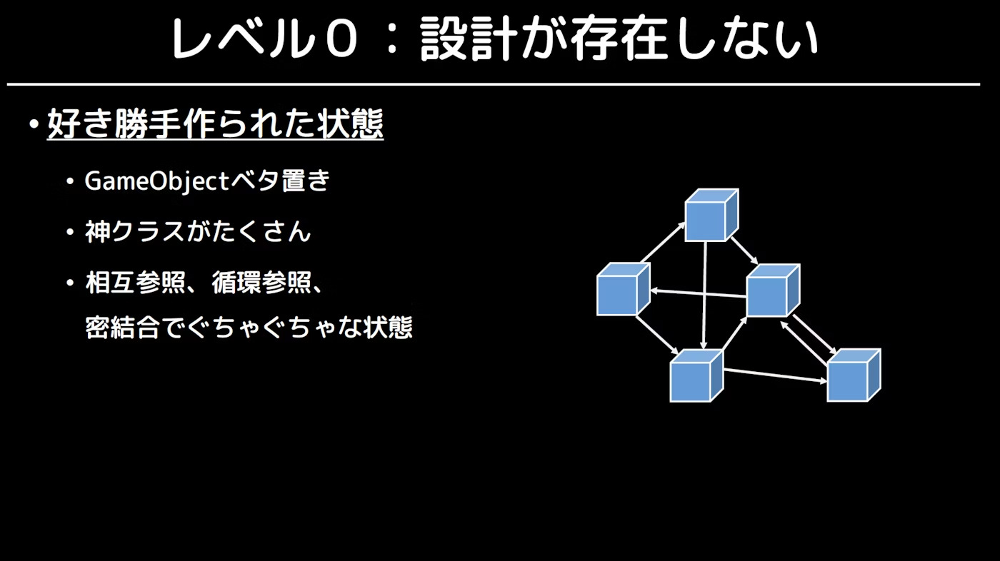

- 後先考えず、MonoBehaviourを継承した上で手当たり次第に実装を行っている状態です。
- この状態で1週間も開発を続ければ見事なスパゲッティコードが誕生することになります。
- レベル1を目指すには
    - まず何を作ろうとしているのかを明確にしよう
    - オブジェクトの責務をハッキリさせよう
    - オブジェクト同士の関係性をハッキリさせよう
    - 制御フローをキレイにしよう

### レベル1: 制御フローは整理されているが密結合な状態

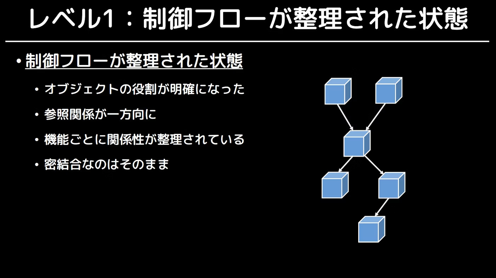

- 「制御フローが整理されている」という状態です。
- この時点でもMonoBehaviourは継承したままです。
- 多少の問題はあるものの全体が破綻するようなことは避けることができます。
- ただしオブジェクト同士は密結合な状態のため、機能拡張や挙動の差し替えといった場面で難が出てきます。
- レベル2を目指すには
    - 「疎結合化する」ということを意識しよう
    - SOLID原則を覚えよう

### レベル2: 制御フローと依存関係が分離した状態

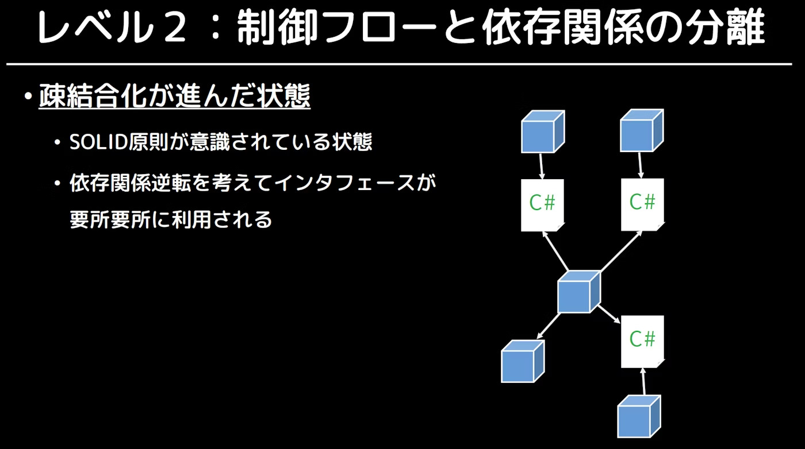

- 疎結合化が進んだ状態です。
- この時点でもMonoBehaviourは継承したままです。
- **おそらくこのあたりが一番実用的なラインです。**
- 「設計何もわからない」という人はこのレベル2を目指してみるのがよいでしょう。
- レベル3を目指すには
    - モジュール化に意識を向ける
    - コンポーネントの原則を覚えよう

### レベル3: モジュール化の意識が現れた状態

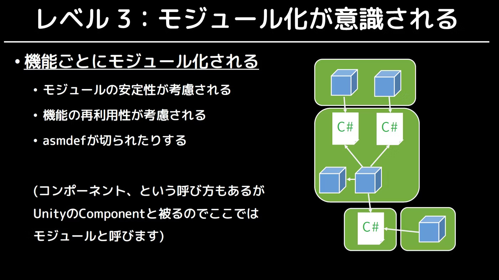

- モジュール化の意識が現れた状態です。
- 詳細な設計ではなく、「モジュールとモジュールがどう関係しあってプロダクトを構築しているか」を見ている状態です。
- 「大規模開発」を見据えた状態ともいえます。
- 小規模開発ではレベル3を達成する必要性は薄いともいえます。
- レベル4を目指すには
    - モジュールからUnity依存を消していく
    - より抽象的なモジュールに分離できないか考えていく

### レベル4: MonoBehaviourへの依存をやめた状態

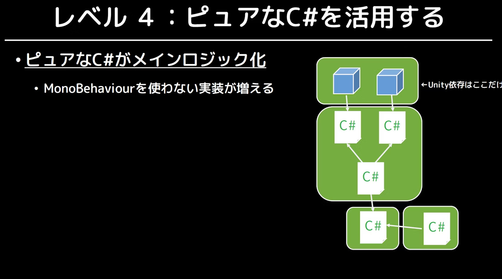

- （もしかしたらレベル3とレベル4は反対かもしれない?）
- MonoBehaviourへの依存をやめた状態です。
- ピュアなC#の比率が増え、MonoBehaviourを継承したクラスの数のほうが少なくなってくる状態です。
- 「Unity」と「Unityが必要ない部分」の切り分けがハッキリしてきます。
- レベル5を目指すには
    - アーキテクチャの考え方を勉強する
    - おすすめは「クリーンアーキテクチャ」

### レベル5: 「アーキテクチャ」が意識された状態

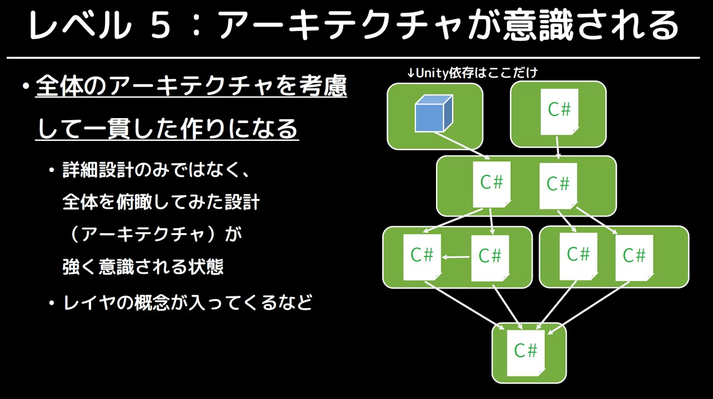

- アーキテクチャが意識された状態です。
- 「プロダクト全体の構成を頭に入れ、どのモジュールとモジュールがどのような関係で成り立っているか」のルールを詳細に決定した状態です。
- ここまでくると完全に大規模開発を想定した状態であり、趣味プロのような小規模プロジェクトでここまでやるのは冗長すぎるかもしれません。

### 注意点

- レベルが高いほど良いというわけではない
    - レベルが高いほど長期的なコストが下がりますが、手間や学習コストも増えます。
    - 自分たちのニーズに合ったレベルを見つけるのが大切。
- 設計レベルはハイブリッドにしても良い
    - ある部分をレベル5で書き、またある部分をレベル2で書いてレベル5の領域に依存させても良いのです。

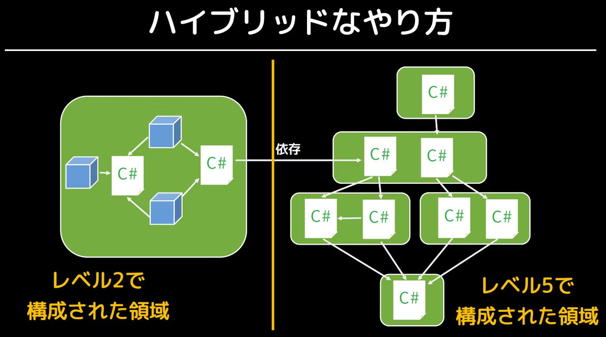

## 3. Clean Architecture

アーキテクチャを考えるうえで最も重要な指針となるのがClean Architectureです。これはとても有名な概念で様々な場所で取り上げられていますが、残念ながら多くの人が誤って解釈してしまっています。ここでは原典に従った正しい説明を行います。

### Clean Architectureとは

Clean Architectureとは、SOLID原則やClean Codeでお馴染みのRobert C. Martinが提唱した概念及びその書籍です。Clean Architectureでは、この世界に存在する様々なアーキテクチャに共通するルールを見出し、「こう設計すれば上手くいきがちだよね」という指針を提示しています。

Clean Architectureが主張していることは以下の2点です。

- 依存関係は上位レベルに向けて一方通行にすること
- 制御フローと依存関係を分離すること

### 依存関係を上位レベルに向けて一方通行にする

第2回の依存性逆転の原則で取り上げた上位/下位の概念を思い出してください。上位とはゲームの本質的かつ抽象的なルールや方針、下位はその具体的な実装です。Clean Architectureが述べる1つ目の主張は、この上位/下位の概念をプロジェクト全体に適用し、依存関係を常に上位レベルに向けて一方通行にせよということです。

> ソースコードの依存性は、内側に向かってのみ向けなければならない。
>
> (Source code dependencies must point only inward, toward higher-level policies.)
>
> Robert C. Martin

Clean Architectureでは、上位のコンポーネントを内側に、下位を外側に置いた同心円状の図を構築し、依存の方向が中心(上位)に向かって一方通行になるようにするべきだと説明しています。


ゲーム開発を例にすると、以下のようにレベルを分けることができます。

|   レベル   | 内容                                                           | 安定性 |
| :--------: | :------------------------------------------------------------- | :----: |
| 高（内側） | ダメージ計算、ターン進行、勝敗判定などのゲームの本質的なルール |  安定  |
|     ↕      | 入力に応じてキャラクターを動かす、敵をスポーンさせるなどの制御 |   ↕    |
| 低（外側） | UI表示、アニメーション、SE再生、セーブ方法などの技術的な詳細   | 不安定 |

この構造において、上位レベルが下位レベルに依存してしまうと何が起きるでしょうか。例えば、ダメージ計算ロジックが特定のUIコンポーネントに依存していたら、UIを変更するだけでダメージ計算のコードまで修正しなくてはいけなくなります。本来安定しているはずのゲームの本質的なルールが、不安定な詳細に引きずられて壊れてしまうのです。

```csharp=
// ❌ Bad: ゲームの本質的なルール（上位）がUI（下位）に依存している
public class DamageCalculator
{
    [SerializeField] Text damageText; // UIへの直接依存！

    public int Calculate(int attack, int defense)
    {
        int damage = Mathf.Max(attack - defense, 0);
        damageText.text = damage.ToString(); // ダメージ計算とUI表示が混在
        return damage;
    }
}
// → UIを変更するとダメージ計算のコードも修正が必要になる
// → ダメージ計算をUI無しでテストできない
// → 本来安定しているはずのロジックが、不安定なUIに振り回される
```

```csharp=
// ✅ Good: 依存関係が上位レベルに向いている
// 上位: ゲームのルール — UIの存在を知らない
public class DamageCalculator
{
    public int Calculate(int attack, int defense)
    {
        return Mathf.Max(attack - defense, 0);
    }
}

// 下位: UI表示 — 上位のDamageCalculatorを知っている
public class DamageView : MonoBehaviour
{
    [SerializeField] Text damageText;
    [SerializeField] DamageCalculator calculator;

    public void ShowDamage(int attack, int defense)
    {
        int damage = calculator.Calculate(attack, defense);
        damageText.text = damage.ToString();
    }
}
// → UIをどれだけ変更してもDamageCalculatorは無傷
// → DamageCalculatorはUI無しでもテスト可能
```

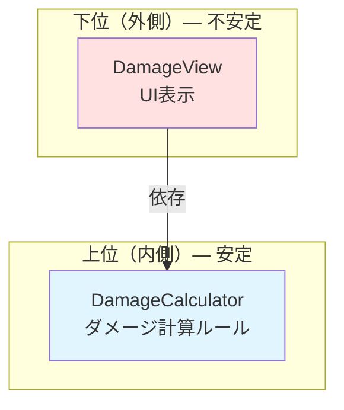

このように、依存関係が常に安定した上位に向かって一方通行に流れるようにする。これがClean Architectureの依存性のルールです。これは依存性逆転の原則をプロジェクト全体のスケールで適用したものだと言えます。

### 制御フローと依存関係を分離する

2つ目の主張は、制御フローと依存関係は別物であり、これらを分けて考えよということです。

制御フローとは、プログラムの処理が実際に実行される順序・方向のことです。例えば「プレイヤーが攻撃ボタンを押す → 攻撃処理が実行される → ダメージが計算される → UIが更新される」という一連の流れが制御フローです。

一方、依存関係とはコードの参照方向のことです。あるクラスが別のクラスの型を知っている、メソッドを呼んでいる、インスタンスを持っている、といった関係です。

ここで重要なのは、制御フローの方向と依存関係の方向は必ずしも一致しないということです。制御フローが A → B → C と流れていても、依存関係が同じ方向とは限りません。先程の依存性のルールに従えば、依存関係は常に上位レベルに向くべきですが、制御フローは上位から下位に向かうこともあれば、下位から上位に向かうこともあります。

例えば、こういう場面を考えてみましょう。ゲームの制御フローとして「敵が倒された → スコアが加算される → UIが更新される」という流れがあるとします。制御フローは「View（敵の撃破検知）→ ルール（スコア加算）→ View（UI更新）」のように、外側から内側へ、そしてまた外側へ流れます。

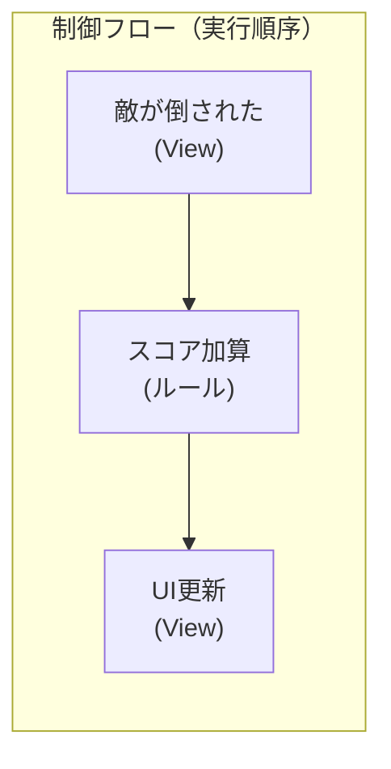

もしこの制御フローをそのまま依存関係にしてしまうと、上位のスコアルールが下位のViewに依存してしまい、依存性のルールに違反します。

```csharp=
// ❌ Bad: 制御フローと依存関係を一致させてしまった
public class ScoreRule
{
    ScoreView scoreView; // 上位が下位に依存している！

    public void AddScore(int amount)
    {
        score += amount;
        scoreView.UpdateDisplay(score); // ルールがUIを直接呼んでいる
    }
}
// → 制御フロー: ScoreRule → ScoreView ✅
// → 依存関係: ScoreRule → ScoreView ❌ (上位が下位に依存)
```

ここで活躍するのが第2回で学んだインターフェースやイベントです。制御フローの方向を維持しながら、依存関係の方向を逆転させることができます。

```csharp=
// ✅ Good: 制御フローと依存関係が分離されている
public class ScoreRule
{
    ReactiveProperty<int> score = new(0);
    public ReadOnlyReactiveProperty<int> Score => score;

    public void AddScore(int amount)
    {
        score.Value += amount;
        // UIの存在を知らない。通知するだけ。
    }
}

public class ScoreView : MonoBehaviour
{
    [SerializeField] Text scoreText;
    [SerializeField] ScoreRule scoreRule; // 下位が上位に依存 ✅

    void Start()
    {
        scoreRule.Score.Subscribe(value =>
        {
            scoreText.text = $"Score: {value}";
        }).AddTo(this);
    }
}
// → 制御フロー: ScoreRule → (通知) → ScoreView（スコアが変わる→表示が更新される）
// → 依存関係: ScoreView → ScoreRule（ViewがRuleを知っている。逆ではない）
// → 制御フローと依存関係の方向が異なっている！
```

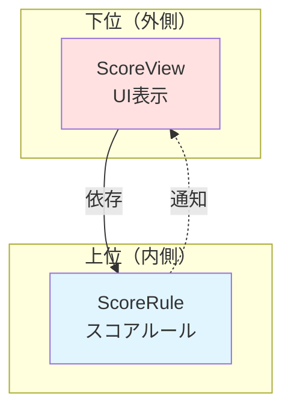

制御フローの方向は `ScoreRule` → `ScoreView` です（スコアが変わると表示が更新される）。しかし依存関係の方向は `ScoreView` → `ScoreRule` です（ViewがRuleを知っていて、Ruleの変更を購読している）。制御フローと依存関係が逆方向になっています。

これこそが「制御フローと依存関係を分離する」ということです。制御フローがどの方向に流れようとも、依存関係は常に上位レベルに向けることができる。そのために、イベントやインターフェースなどの仕組みを活用して、制御フローの方向に縛られない依存関係を設計するのです。

依存性逆転の原則は、まさにこの分離を実現するための手段でした。インターフェースを挟むことで、制御フローは変えずに依存関係だけを逆転させる。Clean Architectureはこの原則をアーキテクチャ全体に適用することを求めているのです。

### Clean Architectureに関する誤解

世間には以下のような誤った言説が出回っています。

- Clean Architectureというアーキテクチャが存在する
    - 存在しません。Clean Architectureは設計の指針を示しただけであり、具体的なアーキテクチャについては言及していません。
- 例の図の通りにレイヤーやコンポーネントを構成するべき
    - 誤りです。あの図はあくまでClean ArchitectureをWebで実践するならこういうやり方もあるという一例を示しただけであり、それに従う理由は一切ありません。

## 4. フレームワークと結婚するな！

Clean Architectureに関連して、Martin氏はフレームワークについて以下のように述べています。

> フレームワークと結婚するな！
>
> (Don't marry the framework!)
>
> Robert C. Martin

ここでの「結婚」とは、上位モジュールがフレームワークに依存してしまうことを意味します。フレームワークは同心円の図において最外殻に位置する、最下位のモジュールです。なので結婚するとフレームワークの都合にプロジェクト全体が振り回されるし、フレームワークのアップデートや仕様変更が入ったときにコード全体を修正しなくてはいけなくなります。最悪の場合、フレームワークが非推奨になったり消滅したりすれば、プロジェクト自体が破綻します。

しかし現実的にはフレームワークとの結婚を完全に避けることはできません。例えばR3はMV(R)Pパターンを組むために上位で使わないと意味がありません。このように、使った方が話が早い場合は結婚が許容されます。しかし、あくまで結婚であるため、一度依存したら途中で切り離すことができない一蓮托生の存在になることには注意しておかなければいけません。結婚するフレームワークはよく考えるべきです。

ところで、Unityは一つの大きなフレームワークです。我々はMonoBehaviourを継承することで `Start()` や `Update()` などのUnityのライフサイクルメソッドを使ったり、GameObjectにアタッチしたりしています。これはまさにフレームワークと結婚している状況に他なりません。しかし、実はUnityと結婚することは回避可能です。

## 5. Pure C#を活用する

Unityと結婚しない方法、それは、MonoBehaviourを使わずPure C#によってクラスを設計することです。

### なぜMonoBehaviourを使いたくないのか

Unityでコードを書く場合、一般的にはMonoBehaviourを継承します。これによって `Start()` や `Update()` などのUnityのライフサイクルメソッドが利用できたり、GameObjectにアタッチできるようになります。このようにUnity上でコードを動かすためにはMonoBehaviourが必須なので、そもそもMonoBehaviourを使わないという選択肢すら思い浮かばないかもしれません。

しかし、実はMonoBehaviourを使っていると色々と悪いことが起こります。まず、コンストラクタが使えません。よって第2回で生焼けオブジェクトについて説明したように、オブジェクトが生焼けになってしまいます。また、インスタンスを生成するにはいちいちGameObjectにアタッチしなくてはいけません。クラスが増えれば増えるほどこの手間は大きくなるし、アタッチし忘れも頻発します。他にも、ライフサイクルがUnityに支配されること、Unityがないとテストができないこと、などなど、とにかくMonoBehaviourを継承していて良いことは全然ありません。

### Pure C#でコードを書く

では実際にPure C#でコードを書いてみましょう。先程のダメージ計算とスコアの例をPure C#で書き直してみます。

```csharp=
// Pure C#で書かれた上位レベルのクラス — MonoBehaviourを継承しない
using R3;

public class DamageCalculator
{
    public int Calculate(int attack, int defense)
    {
        return Math.Max(attack - defense, 0);
    }
}

public class ScoreRule
{
    readonly ReactiveProperty<int> score = new(0);
    public ReadOnlyReactiveProperty<int> Score => score;

    public void AddScore(int amount)
    {
        score.Value += amount;
    }

    public void Dispose()
    {
        score.Dispose();
    }
}

public class EnemyManager
{
    readonly DamageCalculator damageCalculator;
    readonly ScoreRule scoreRule;

    // コンストラクタでDIする。生焼けにならない！
    public EnemyManager(DamageCalculator damageCalculator, ScoreRule scoreRule)
    {
        this.damageCalculator = damageCalculator;
        this.scoreRule = scoreRule;
    }

    public void OnEnemyDefeated(int playerAttack, int enemyDefense)
    {
        int damage = damageCalculator.Calculate(playerAttack, enemyDefense);
        scoreRule.AddScore(damage * 10);
    }
}
// → 全てPure C#。Unityが無くても動く
// → コンストラクタで依存性を注入するので生焼けにならない
// → 単体テストが容易
```

ViewはGameObjectを扱うため、流石にMonoBehaviourを使う必要があります。しかし、Presenterはその必要がないので、Pure C#で書くことができます。

```csharp=
// ViewはMonoBehaviourを使う — UnityのUIに依存するのは仕方がない
using R3;
using UnityEngine;
using UnityEngine.UI;

public class ScoreView : MonoBehaviour
{
    [SerializeField] Text scoreText;

    public void SetScore(int score)
    {
        scoreText.text = $"Score: {score}";
    }
}

// PresenterもPure C#で書ける — 橋渡しをするだけなのでMonoBehaviourは不要
public class ScorePresenter : IDisposable
{
    readonly CompositeDisposable compositeDisposable = new();

    public ScorePresenter(ScoreRule scoreRule, ScoreView scoreView)
    {
        scoreRule.Score.Subscribe(score =>
        {
            scoreView.SetScore(score);
        }).AddTo(compositeDisposable);
    }

    public void Dispose()
    {
        compositeDisposable.Dispose();
    }
}
// → ViewはMonoBehaviourを使う（UIの操作にUnityが必要だから）
// → しかしPresenterとScoreRuleはPure C#。Unityに依存しない
```

ここで、今まではGameObjectにアタッチすることでUnityがインスタンスを生成してくれ、DIもインスペクターから行えました。しかし、Pure C#になったことでそれらを全部自分でやる必要があります。そのため、各クラスは `[SerializeField]` の代わりにコンストラクタから必要なインスタンスを受け取るようにします。また、インスタンスの生成とDIを担当し、エントリーポイントを動かすクラスを作成します。このようなクラスをComposition Rootといいます。Composition Root自身は、自分を生成してくれるクラスが他にないのでこれもMonoBehaviourを使う必要があります。

```csharp=
// Composition Root: 全てのインスタンスを生成し、依存性を注入する
// MonoBehaviourを使う — Unityにインスタンスを生成してもらう必要があるため
public class GameLifeTimeScope : MonoBehaviour
{
    // ViewはMonoBehaviourなのでインスペクターから注入
    [SerializeField] ScoreView scoreView;

    ScorePresenter scorePresenter;

    void Start()
    {
        // Pure C#のインスタンスを自分で生成する
        var damageCalculator = new DamageCalculator();
        var scoreRule = new ScoreRule();
        var enemyManager = new EnemyManager(damageCalculator, scoreRule);

        // PresenterもPure C#なのでコンストラクタで生成・DI
        scorePresenter = new ScorePresenter(scoreRule, scoreView);

        // これで全ての依存関係が組み上がった！
    }

    void OnDestroy()
    {
        scorePresenter?.Dispose();
    }
}
// → GameLifeTimeScopeが「何を生成し、何をどこに渡すか」を全て管理する
// → 各クラスは自分の依存先がどこから来るかを知る必要がない
// → GameLifeTimeScopeを見れば、プロジェクト全体の依存関係が一目で分かる
```

こうすることで、Viewなどの下位で最低限MonoBehaviourを使うだけで、他のクラスは全てPure C#で書くことができます。

### MonoBehaviourを使う場面

先程の例のように、MonoBehaviourを全てPure C#で代替できるわけではありません。ViewのクラスはGameObjectにアタッチするためにMonoBehaviourが必要ですし、Composition RootもUnityにインスタンスを生成して貰わなければ動きません。しかし、逆に言えばそれ以外のクラスは基本的にMonoBehaviourを使わなくても良いということです。つまり、ViewとComposition RootだけがMonoBehaviourを使い、その他は全てPure C#で書くのが理想です。

## 6. VContainerを使う

しかし次に問題になってくるのが、DIの作業が大変すぎるということです。別にMonoBehaviourを使っていたときも十分大変でしたが、Pure C#ではクラス数が多くなればなるほど、どのインスタンスを先に生成し、そしてどこに渡せばいいのかということが煩雑になり手に負えなくなります。

```csharp=
// クラスが増えるほどComposition Rootが肥大化していく...
public class GameLifeTimeScope : MonoBehaviour
{
    [SerializeField] ScoreView scoreView;
    [SerializeField] InventoryView inventoryView;
    [SerializeField] BattleView battleView;
    [SerializeField] MapView mapView;
    // ... Viewが増えるたびにここも増える

    void Start()
    {
        // 生成順序を間違えると動かない！
        var damageCalculator = new DamageCalculator();
        var scoreRule = new ScoreRule();
        var inventoryRule = new InventoryRule();
        var battleRule = new BattleRule(damageCalculator);
        var mapRule = new MapRule();
        var enemyManager = new EnemyManager(damageCalculator, scoreRule);
        var questManager = new QuestManager(battleRule, inventoryRule, mapRule);
        // ... 際限なく増えていく。DIの地獄！
    }
}
```

そこで登場するのがDIコンテナです。

### DIコンテナとは

DIコンテナとは、クラスの登録と依存解決を自動で行ってくれる仕組みです。開発者はクラスを登録するだけで、DIコンテナが以下の作業を全て自動でやってくれます。

- インスタンスの生成
- コンストラクタの引数を解析し、必要な依存先を特定する
- 依存先のインスタンスを自動で注入する
- 生成順序の自動解決（Aを作るにはBが必要、Bを作るにはCが必要...を自動で解決）
- インスタンスのライフタイム管理（シングルトン、スコープ付きなど）

### VContainerとは

VContainerは、Unity向けに作られた高速・軽量なDIコンテナフレームワークです。すこし昔はZenjectというフレームワークがよく使われていましたが、現在ではVContainerの方が主流です。

### LifetimeScopeを使ったComposition Root

VContainerでは `LifetimeScope` というクラスを継承してComposition Rootを作成します。先程の手動DIの例を、VContainerを使って書き直してみましょう。

```csharp=
using VContainer;
using VContainer.Unity;

// VContainerのLifetimeScopeを継承する — これがComposition Rootになる
public class GameLifeTimeScope : LifetimeScope
{
    [SerializeField] ScoreView scoreView;

    protected override void Configure(IContainerBuilder builder)
    {
        // Pure C#クラスの登録
        builder.Register<DamageCalculator>(Lifetime.Singleton);
        builder.Register<ScoreRule>(Lifetime.Singleton);
        builder.Register<EnemyManager>(Lifetime.Singleton);

        // Presenterをエントリーポイントとして登録
        builder.RegisterEntryPoint<ScorePresenter>();

        // MonoBehaviourの登録（シーン上のインスタンスを渡す）
        builder.RegisterComponent(scoreView);
    }
}
// → 「何を生成するか」を宣言するだけ！
// → 生成順序やコンストラクタへの注入は全てVContainerが自動で行う
// → クラスが増えても1行追加するだけで済む
```

手動で書いていたComposition Rootと比べ、でインスタンスを生成して引数で渡す手間が消えとてもスッキリしました。

### Register

VContainerにクラスを登録するには `builder.Register<T>(Lifetime)` を使います。`Lifetime` 引数によってインスタンスのライフタイムを指定します。特に何もなければ `Singleton` にするとよいです。

```csharp=
// Pure C#クラスの登録（生存期間を明示的に指定する）
builder.Register<ScoreRule>(Lifetime.Singleton);  // アプリ全体で1つのインスタンス
builder.Register<EnemyManager>(Lifetime.Scoped);  // スコープ内で1つのインスタンス
builder.Register<DamageEffect>(Lifetime.Transient); // 注入のたびに新しいインスタンス
```

インターフェースと実装を紐付けて登録することもできます。

```csharp=
// IRouteSearchを要求されたらAStarRouteSearchを注入する
builder.Register<AStarRouteSearch>(Lifetime.Singleton).As<IRouteSearch>();
```

MonoBehaviourの登録には専用のメソッドを使います。

```csharp=
// シーン上の既存のMonoBehaviourを登録（[SerializeField]で参照を持つ）
builder.RegisterComponent(scoreView);

// ヒエラルキーから自動的にMonoBehaviourを探して登録
builder.RegisterComponentInHierarchy<ScoreView>();
```

### RegisterEntryPoint

VContainerの大きな特徴の一つが、Pure C#のクラスをUnityのライフサイクルイベントに接続できることです。MonoBehaviourを使わずに、Pure C#のクラスで `Start()` や `Update()` 相当の処理を実行できます。そうなると、エントリーポイントですらPure C#で書くことができるようになります。

`builder.RegisterEntryPoint<T>()` でエントリーポイントとして登録し、対応するインターフェースを実装することで、それぞれのタイミングで処理が実行されます。

```csharp=
// Pure C#のクラスをエントリーポイントにできる！
public class ScorePresenter : IStartable, IDisposable
{
    readonly ScoreRule scoreRule;
    readonly ScoreView scoreView;
    readonly CompositeDisposable compositeDisposable = new();

    // VContainerが自動でコンストラクタ引数を注入してくれる
    public ScorePresenter(ScoreRule scoreRule, ScoreView scoreView)
    {
        this.scoreRule = scoreRule;
        this.scoreView = scoreView;
    }

    // IStartableを実装 → MonoBehaviourのStart()と同じタイミングで呼ばれる
    void IStartable.Start()
    {
        scoreRule.Score.Subscribe(score =>
        {
            scoreView.SetScore(score);
        }).AddTo(compositeDisposable);
    }

    public void Dispose()
    {
        compositeDisposable.Dispose();
    }
}
```

これにより、DIの手間を考える必要がなくなりました。単一責任になるようにクラスを分割することもよりやりやすくなり嬉しいです。

## 7. 例) オニオンアーキテクチャ

では実際にこれまでに紹介した内容を用いて具体的なアーキテクチャを組んでみましょう。ここでは例としてオニオンアーキテクチャを取り上げます。これは私が最近Unityで開発するときに使用しているアーキテクチャです。あくまで例の一つであり、採用するアーキテクチャはプロジェクトによって異なることを念頭に、参考程度に見てください。

### オニオンアーキテクチャとは

オニオンアーキテクチャとは、Clean Architectureの同心円の考え方を具体的なレイヤー構造に落とし込んだアーキテクチャの一つです。名前の通り玉ねぎのような同心円状のレイヤー構造を持ち、内側ほど安定した本質的なルール、外側ほど技術的な詳細を担います。依存関係は常に内側に向き、外側の変更が内側に影響しないようにします。

オニオンアーキテクチャはWeb開発のバックエンドなどでも使用されているアーキテクチャで、Unityにおいてはアウトゲーム部分と特に相性が良いです。どこに何を書けば良いかが明確で、機能追加や修正にめちゃくちゃ強く、テストも書きやすいのがメリットです。逆に、使いこなすには相応の知識が求められることと、インゲームには若干適用しにくさがあるのがデメリットです。しかしインゲームが全く書けないわけではなく、パズルゲームや音ゲーなど、Unity固有の機能に深く依存しないゲームであれば相性はかなり良いです。

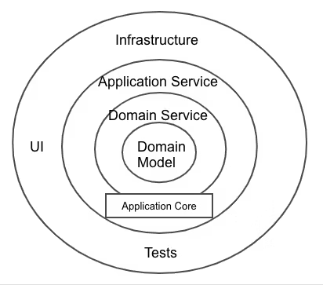

ここでは、Unityにおける実際の開発に合わせて各クラスを以下の5つのレイヤーに分けます。

|    レイヤー     |  位置  | 役割                                       | 構成要素                         |
| :-------------: | :----: | :----------------------------------------- | :------------------------------- |
|     Domain      | 最内殻 | ゲームの本質的なルールやデータ構造         | Model, Service, Repository（IF） |
|   Application   |  内側  | ゲームの具体的な進行・手順                 | UseCase, Port（IF）              |
|  Presentation   |  外側  | UIやユーザー入力の処理                     | Presenter, View                  |
| Infrastructure  |  外側  | セーブ、通信、外部サービスなどの技術的詳細 | Repositoryなどの実装             |
| CompositionRoot | 最外殻 | 全レイヤーのDI                             | LifetimeScope                    |

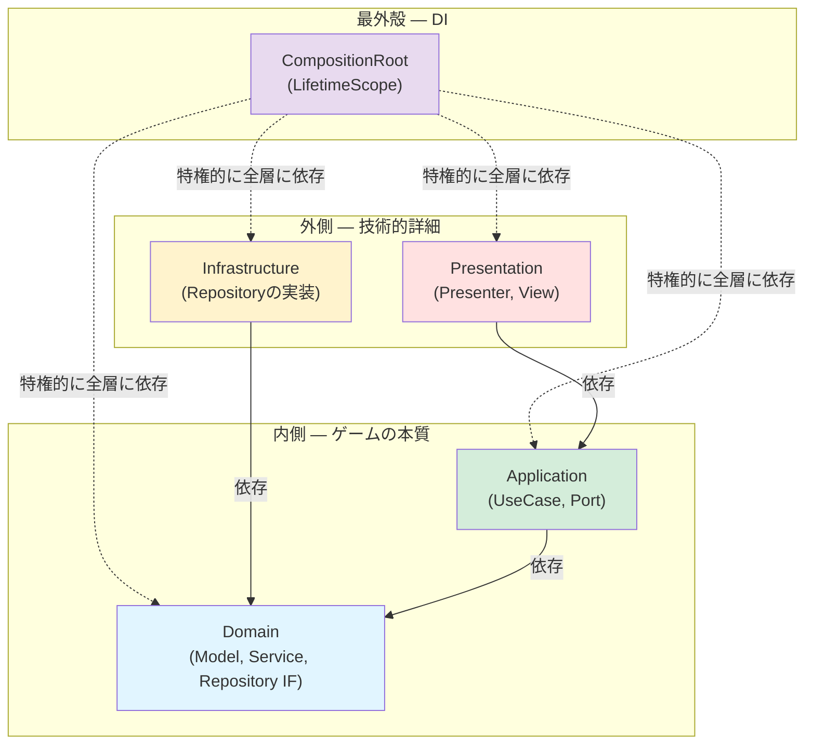

### Domain層

Domain層は最も内側のレイヤーであり、ゲームの本質的なルールやデータ構造を定義します。ドメインとは、「そのシステムが解決しようとしている、現実世界のテーマや業務領域」のことです。つまりUnity文脈に当てはめると、「そのゲームの根幹となるルールや知識」ということになります。

Domain層は最も内側なので他のどのレイヤーにも依存しません。UIがどうなっているか、データがどこに保存されるかといったことは一切知りません。

#### Model

ドメインモデルであり、ゲームの本質的なルールやデータを持つクラスです。スコア、HP、ダメージ計算など、ゲームのルールやビジネスロジック表現します。

```csharp=
// Domain層 - Model: ゲームの本質的なルールとデータ
public class ScoreModel
{
    readonly ReactiveProperty<int> score = new(0);
    public ReadOnlyReactiveProperty<int> Score => score;

    public void Add(int amount)
    {
        if (amount < 0) throw new ArgumentException("スコアは負の値を加算できない");
        score.Value += amount;
    }

    public void Reset()
    {
        score.Value = 0;
    }

    public void Dispose()
    {
        score.Dispose();
    }
}

public class DamageCalculator
{
    public int Calculate(int attack, int defense)
    {
        return Math.Max(attack - defense, 0);
    }
}
// → Unityを知らない。UIを知らない。セーブ方法を知らない。
// → 「ゲームのルール」だけを純粋に表現している
```

#### Service

ドメインサービスです。複数のModelにまたがる処理や、単一のModelに属さない複雑なドメインロジックを担うクラスです。例えば、ダメージ計算の結果をスコアに反映する処理は、`DamageCalculator` と `ScoreModel` の両方にまたがるため、ドメインサービスとして切り出すことができます。

```csharp=
// Domain層 - Service: 複数のModelにまたがるドメインロジック
public class BattleService
{
    readonly DamageCalculator damageCalculator;
    readonly ScoreModel scoreModel;

    public BattleService(DamageCalculator damageCalculator, ScoreModel scoreModel)
    {
        this.damageCalculator = damageCalculator;
        this.scoreModel = scoreModel;
    }

    public void ProcessEnemyDefeat(int playerAttack, int enemyDefense)
    {
        int damage = damageCalculator.Calculate(playerAttack, enemyDefense);
        scoreModel.Add(damage * 10);
    }
}
// → DamageCalculatorとScoreModelの両方を使う処理
// → どちらか一方のModelに押し込むと不自然になる処理を担う
```

#### Repository

データの永続化（セーブやロード）に関するRepositoryパターンのインターフェースです。「データをどう保存するか」という具体的な方法は知らず、その契約だけを定義します。実装はInfrastructure層に任せます。

```csharp=
// Domain層 - Repository: 永続化の契約（インターフェースのみ）
public interface IScoreRepository
{
    void Save(int score);
    int Load();
}
// → 「スコアを保存・読み込みできる」という契約だけ
// → JSON? PlayerPrefs? サーバー? それはDomainの関心ではない
```

### Application層

Application層は、Domain層のオブジェクトを組み合わせてユースケースを記述する層です。ユースケースとは、「ユーザーがシステムを用いて達成したい事柄」のことです。例えば、ボタンのUIを押したとき、ユーザーは何がしたいのか？キー入力をしたとき、ユーザーは何がしたいのか？そういったこと一つ一つがユースケースです。

#### UseCase

ユースケースを記述するクラスです。Domain層のオブジェクトを組み合わせてユースケースを作ります。ここにおいて、UseCaseの中にはビジネスロジックを記述しません。ビジネスロジックはDomain層に記述し、UseCaseはそのメソッドを叩くだけです。1クラス1メソッド（`Execute`）が理想で、クラス名はそのユースケースが何をするかを明確に表す名前にします。

```csharp=
// Application層 - UseCase

// 「敵を倒す」ユースケース
public class DefeatEnemyUseCase
{
    readonly BattleService battleService;

    public DefeatEnemyUseCase(BattleService battleService)
    {
        this.battleService = battleService;
    }

    public void Execute(int playerAttack, int enemyDefense)
    {
        battleService.ProcessEnemyDefeat(playerAttack, enemyDefense);
    }
}

// 「ゲームを開始する」ユースケース
public class StartGameUseCase
{
    readonly ScoreModel scoreModel;

    public StartGameUseCase(ScoreModel scoreModel)
    {
        this.scoreModel = scoreModel;
    }

    public void Execute()
    {
        scoreModel.Reset();
    }
}

// 「ゲームを終了する」ユースケース
public class FinishGameUseCase
{
    readonly IGameOverPort gameOverPort;
    readonly ScoreModel scoreModel;

    public FinishGameUseCase(
        IGameOverPort gameOverPort,
        ScoreModel scoreModel)
    {
        this.gameOverPort = gameOverPort;
        this.scoreModel = scoreModel;
    }

    public void Execute()
    {
        // Portを通じてPresentation層にゲームオーバー画面の表示を要求する
        gameOverPort.ShowGameOverScreen(scoreModel.Score.CurrentValue);
    }
}
// → 各UseCaseは1つのExecuteメソッドだけを持つ
// → クラス名を見ればそのUseCaseが何をするか分かる
// → ビジネスロジックはDomain層に任せ、UseCaseはそれを組み合わせるだけ
```

#### Port

Portは、Application層からPresentation層のPresenterにアクセスするためのインターフェースです。

Viewの更新を全てリアクティブに行うことができれば理想的なのですが、現実のゲーム開発においては、Web開発などの他の開発と比べてViewが非常に大きな意味を持っています。故に、UseCaseが明示的にViewを扱いたい場面というのはよくあります。

そこで、Application層にPresenterへのインターフェースを定義し、Presentation層のPresenterがそれを実装します。こうすることで、依存の方向を保ったままUseCaseがViewに干渉できるようになります。

```csharp=
// Application層 - Port: Presenterへのインターフェース
public interface IGameOverPort
{
    void ShowGameOverScreen(int finalScore);
}
// → Application層が定義するインターフェース
// → 「ゲームオーバー画面を表示できる何か」という抽象
// → 具体的なUIの見た目や演出はPresentation層の関心
```

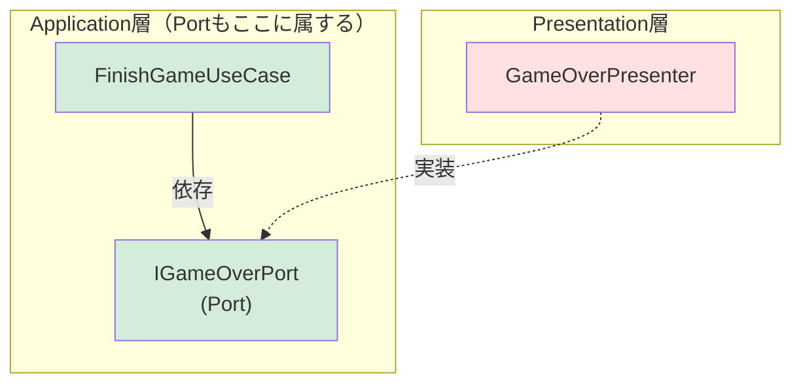

### Presentation層

Presentation層は、ユーザーとシステムの境界を扱います。すなわち、ViewとPresenterです。

#### View

UIの表示やユーザー入力の受け取りを担う。GameObjectやUIコンポーネントにアクセスする必要があるため、MonoBehaviourの継承を許可します。

```csharp=
// Presentation層 - View: UIの表示（MonoBehaviourを使う唯一の場所）
public class ScoreView : MonoBehaviour
{
    [SerializeField] Text scoreText;

    public void SetScore(int score)
    {
        scoreText.text = $"Score: {score}";
    }
}

public class GameOverView : MonoBehaviour
{
    [SerializeField] GameObject gameOverPanel;
    [SerializeField] Text finalScoreText;

    public void Show(int finalScore)
    {
        gameOverPanel.SetActive(true);
        finalScoreText.text = $"Final Score: {finalScore}";
    }
}
```

#### Presenter

Application層とViewの橋渡しを担います。

```csharp=
// Presentation層 - Presenter: Pure C#で書く（MonoBehaviourは使わない）

// スコア表示のPresenter — リアクティブでUIを自動更新
public class ScorePresenter : IStartable, IDisposable
{
    readonly ScoreModel scoreModel;
    readonly ScoreView scoreView;
    readonly CompositeDisposable compositeDisposable = new();

    public ScorePresenter(ScoreModel scoreModel, ScoreView scoreView)
    {
        this.scoreModel = scoreModel;
        this.scoreView = scoreView;
    }

    public void Start()
    {
        // ReactivePropertyをSubscribeしてUIを自動更新
        scoreModel.Score.Subscribe(score =>
        {
            scoreView.SetScore(score);
        }).AddTo(compositeDisposable);
    }

    public void Dispose()
    {
        compositeDisposable.Dispose();
    }
}

// ゲームオーバーのPresenter — PortでUseCaseから直接呼ばれる
public class GameOverPresenter : IGameOverPort
{
    readonly GameOverView gameOverView;

    public GameOverPresenter(GameOverView gameOverView)
    {
        this.gameOverView = gameOverView;
    }

    // IGameOverPortの実装 — UseCaseから明示的に呼ばれる
    public void ShowGameOverScreen(int finalScore)
    {
        gameOverView.Show(finalScore);
    }
}
// → ScorePresenterはリアクティブ（Subscribe）でUIを更新
// → GameOverPresenterはPort（IGameOverPort）でUseCaseから直接呼ばれる
// → どちらもPure C#。MonoBehaviourはViewだけ。
```

### Infrastructure層

Infrastructure層は、Domain層で定義されたRepositoryインターフェースの具体的な実装を担います。

```csharp=
// Infrastructure層: Domain層のIScoreRepositoryを実装する
public class JsonScoreRepository : IScoreRepository
{
    readonly string filePath;

    public JsonScoreRepository(string filePath)
    {
        this.filePath = filePath;
    }

    public void Save(int score)
    {
        var data = new ScoreSaveData { score = score };
        string json = JsonUtility.ToJson(data);
        File.WriteAllText(filePath, json);
    }

    public int Load()
    {
        if (!File.Exists(filePath)) return 0;
        string json = File.ReadAllText(filePath);
        var data = JsonUtility.FromJson<ScoreSaveData>(json);
        return data.score;
    }

    [Serializable]
    struct ScoreSaveData
    {
        public int score;
    }
}
// → IScoreRepositoryを実装しているだけ
// → セーブ方法を変えたい？ このクラスを差し替えるだけでOK
// → Domain層やApplication層のコードは一切変更不要
```

### CompositionRoot層

CompositionRoot層は、全てのレイヤーのクラスを知り、インスタンスの生成とDIを担う特別な層です。VContainerの `LifetimeScope` がこの役割を果たします。

CompositionRoot層は**特権的に全てのレイヤーに依存します**。通常、依存関係は内側にしか向けられませんが、CompositionRoot層だけはこのルールの例外です。全てのクラスを知ってDIを組み立てるためには、全層を参照する必要があるからです。

```csharp=
// CompositionRoot層: 全レイヤーに依存する特権的な層
using VContainer;
using VContainer.Unity;

public class GameLifetimeScope : LifetimeScope
{
    [SerializeField] ScoreView scoreView;
    [SerializeField] GameOverView gameOverView;

    protected override void Configure(IContainerBuilder builder)
    {
        // Domain層
        builder.Register<DamageCalculator>(Lifetime.Singleton);
        builder.Register<ScoreModel>(Lifetime.Singleton);
        builder.Register<BattleService>(Lifetime.Singleton);

        // Application層
        builder.Register<DefeatEnemyUseCase>(Lifetime.Singleton);
        builder.Register<StartGameUseCase>(Lifetime.Singleton);
        builder.Register<FinishGameUseCase>(Lifetime.Singleton);

        // Presentation層
        builder.RegisterComponent(scoreView);
        builder.RegisterComponent(gameOverView);
        builder.RegisterEntryPoint<ScorePresenter>();
        // PortのDI: IGameOverPortを要求されたらGameOverPresenterを注入する
        builder.Register<GameOverPresenter>(Lifetime.Singleton).As<IGameOverPort>();

        // Infrastructure層
        builder.Register<JsonScoreRepository>(Lifetime.Singleton)
            .WithParameter("filePath", "save.json")
            .As<IScoreRepository>();
    }
}
// → 全レイヤーのクラスを登録し、依存関係を組み立てる
// → PortやRepositoryのインターフェースと実装の紐付けはここで行う
// → この層だけが全レイヤーを知ることが許される
```

### レイヤー間の依存関係

全体の依存関係を確認してみましょう。

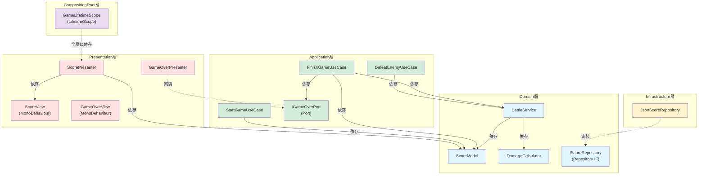

全ての依存関係が内側（上位）に向かって一方通行になっていることが分かります。

## 8. namespaceを活用する

アーキテクチャのレイヤーをコード上で明確にするために、C#のnamespace機能を活用しましょう。namespaceはクラスをグループ化する仕組みで、どのクラスがどのレイヤーに属しているかをコード上で明示できます。

```csharp=
// Domain層のクラス
namespace MyGame.Domain
{
    public class ScoreModel { /* ... */ }
    public class DamageCalculator { /* ... */ }
    public class BattleService { /* ... */ }
    public interface IScoreRepository { /* ... */ }
}

// Application層のクラス
namespace MyGame.Application
{
    using MyGame.Domain; // Domain層だけを参照する ✅

    public class DefeatEnemyUseCase { /* ... */ }
    public class StartGameUseCase { /* ... */ }
    public class FinishGameUseCase { /* ... */ }
    public interface IGameOverPort { /* ... */ }
}

// Presentation層のクラス
namespace MyGame.Presentation
{
    using MyGame.Application; // Application層を参照する ✅
    using MyGame.Domain;
    // using MyGame.Infrastructure; ← これはダメ！同じ層や外側の層に依存してはいけない

    public class ScoreView : MonoBehaviour { /* ... */ }
    public class ScorePresenter { /* ... */ } // Pure C#！
    public class GameOverPresenter : IGameOverPort { /* ... */ }
}

// Infrastructure層のクラス
namespace MyGame.Infrastructure
{
    using MyGame.Domain; // Domain層を参照する ✅

    public class JsonScoreRepository : IScoreRepository { /* ... */ }
}

// CompositionRoot層のクラス
namespace MyGame.CompositionRoot
{
    using MyGame.Domain; // 全層を参照 ✅（特権）
    using MyGame.Application;
    using MyGame.Presentation;
    using MyGame.Infrastructure;

    public class GameLifetimeScope : LifetimeScope { /* ... */ }
}
```

namespaceを使うことで、クラスがどのレイヤーに属して、どのレイヤーに依存しているかが明らかになります。また、異なるnamespaceに同名のクラスが存在しても衝突することがありません。

## 9. Assembly Definitionを活用する

しかし、namespaceには依存関係を強制する力はありません。usingさえすればアーキテクチャに違反するレイヤーに依存することもできてしまいます。これでは、アーキテクチャはただの口約束で、実際にそのルールが守れていることが保証できません。

そこで登場するのがAssembly Definitionです。Assembly DefinitionはUnityのスクリプトのアセンブリを分割するものです。これを使うと、あるアセンブリが参照できる他のアセンブリを明示的に指定でき、それ以外のアセンブリのクラスは参照できなくなります。つまり、依存関係をコンパイルレベルで強制できるのです。

### Assembly Definitionの作成

Assembly DefinitionはUnityエディタの `Assets > Create > Assembly Definition` から作成できます。各レイヤーに対応するフォルダにasmdefファイルを配置します。

```
Assets/
├── Scripts/
│   ├── Domain/
│   │   ├── MyGame.Domain.asmdef    ←
│   │   ├── ScoreModel.cs
│   │   ├── DamageCalculator.cs
│   │   ├── BattleService.cs
│   │   └── IScoreRepository.cs
│   ├── Application/
│   │   ├── MyGame.Application.asmdef ←
│   │   ├── DefeatEnemyUseCase.cs
│   │   ├── StartGameUseCase.cs
│   │   ├── FinishGameUseCase.cs
│   │   └── IGameOverPort.cs
│   ├── Presentation/
│   │   ├── MyGame.Presentation.asmdef ←
│   │   ├── ScoreView.cs
│   │   ├── ScorePresenter.cs
│   │   └── GameOverPresenter.cs
│   ├── Infrastructure/
│   │   ├── MyGame.Infrastructure.asmdef ←
│   │   └── JsonScoreRepository.cs
│   └── CompositionRoot/
│       ├── MyGame.CompositionRoot.asmdef ←
│       └── GameLifetimeScope.cs
```

### 依存関係の強制

各asmdefファイルのインスペクターで「Assembly Definition References」を設定することで、そのアセンブリが参照できるアセンブリを制限できます。自分のプロジェクトのアセンブリだけでなく、R3やVContainerなど使用するフレームワークのアセンブリへの参照もここで設定しないと使えません。それくらいAssembly Definitionは強力で、その代わりにどのアセンブリに依存するかは手動で設定しなくてはいけないのです。

この設定により、例えばDomain層のクラスからPresentation層のクラスを参照しようとすると、コンパイルエラーになります。依存性のルール違反を人間のレビューに頼らず、コンパイラが自動的に検出してくれるのです。

```csharp=
// Domain層のコード
namespace MyGame.Domain
{
    // using MyGame.Presentation; ← コンパイルエラー！参照が許可されていない
    // asmdefが依存関係を強制してくれる

    public class ScoreModel
    {
        // Presentation層のクラスを使おうとしても使えない。安全！
    }
}
```

## 参考文献

- [Unityにおける設計パターン](https://speakerdeck.com/torisoup/unityniokerushe-ji-patan)
- [Unityにおける「設計レベル」を定義してみた](https://qiita.com/toRisouP/items/79b97c472e588bb91c52)
- [Clean Architecture　達人に学ぶソフトウェアの構造と設計 (アスキードワンゴ)](https://amzn.asia/d/0baD35zh)
- [プロダクトに合わせたアーキテクチャの作り方と原則【読書ログ】](https://zenn.dev/pandanoir/articles/13042e7a39557a)
- [Unityでオニオンアーキテクチャ](https://www.slideshare.net/slideshow/unity-148151736/148151736)