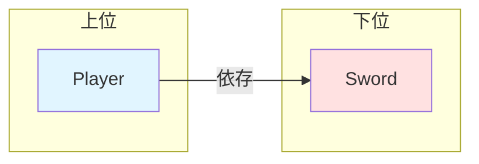
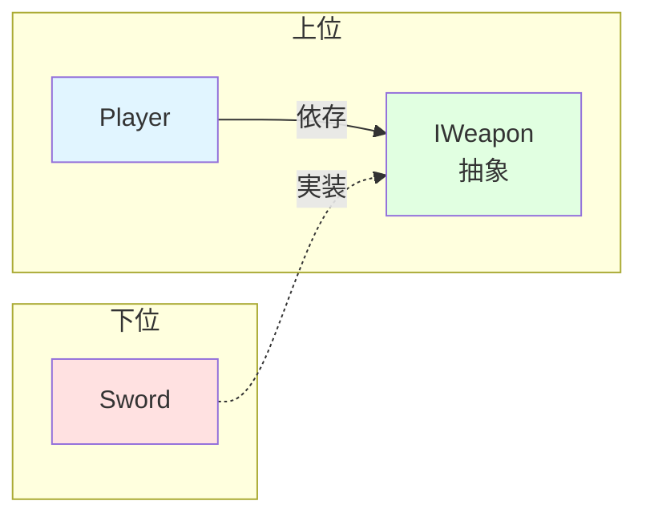

# 3. SOLID原則とは


クラス設計を考えるうえで最も有名な指針であるSOLID原則について確認します。SOLID原則はOOPにおける5つの原則の頭文字をとったものです。

| 頭文字 | 原則名                           | 概要                                       |
| :----: | :------------------------------- | :----------------------------------------- |
|   S    | 単一責任の原則 (SRP)             | クラスの変更理由はただ1つであるべき        |
|   O    | 開放閉鎖の原則 (OCP)             | 拡張に対して開き、修正に対して閉じるべき   |
|   L    | リスコフの置換原則 (LSP)         | 派生型は基本型と置換可能であるべき         |
|   I    | インターフェース分離の原則 (ISP) | 使わないメソッドへの依存を強制すべきでない |
|   D    | 依存性逆転の原則 (DIP)           | 上位は下位の具体に依存すべきでない         |

### S: 単一責任の原則 (Single Responsibility Principle)

> クラスに変更を加える理由は、ただ1つでなければならない
>
> (A class should have one, and only one, reason to change.)
>
> Robert C. Martin

変更理由が一つとは、つまりクラスが持つ責務が一つだけであるということです。ソフトウェアにおける責務とは、「ある関心事について、不正な動作にならないよう、正常に動作するよう制御する任務」です。もし一つのクラスが複数の責務を持っていると、ある責務に関する修正が別の責務にまで影響を及ぼすリスクがあります。また、複数の関心事が入り混じることで可読性も落ち、そのクラスが何をしているのか把握しづらくなります。

そこで、責務ごとにクラスを分割します。そうすることで、片方の変更がもう片方に影響するリスクがなくなり、読みやすくなります。

### O: 開放閉鎖の原則 (Open-Closed Principle)

> ソフトウェアの構成要素は、拡張に対して開いていて、修正に対して閉じていなければならない
>
> (Software entities should be open for extension, but closed for modification.)
>
> Bertrand Meyer

「拡張に対して開いている」とは新しい機能を追加できること、「修正に対して閉じている」とは既存のコードを変更しなくてよいということです。つまり、新機能を追加する際には、理想的にはコードの修正ではなく追加によって行えるようにするべきということです。

ここで活躍するのがインターフェースです。第1回で紹介したStrategyパターンのように、インターフェースによって処理を抽象化すれば機能追加をクラスの追加によって行うことができます。

```csharp=
// ❌ Bad: 新しい敵を追加するたびにif文を修正する必要がある
public class EnemySpawner : MonoBehaviour
{
    public void SpawnEnemy(string type)
    {
        if (type == "Slime")
        {
            // スライム生成
        }
        else if (type == "Goblin")
        {
            // ゴブリン生成
        }
        // 新しい敵を追加するたびにここを修正
    }
}
```

```csharp=
// ✅ Good: 新しい敵はクラスを追加するだけで対応できる
public interface IEnemy { void Initialize(); }

public class Slime : IEnemy { public void Initialize() { /* 初期化 */ } }
public class Goblin : IEnemy { public void Initialize() { /* 初期化 */ } }

public class EnemySpawner : MonoBehaviour
{
    public void SpawnEnemy(IEnemy enemy)
    {
        enemy.Initialize();
        // 新しい敵を追加してもこのコードは変更不要
    }
}
```

### L: リスコフの置換原則 (Liskov Substitution Principle)

> 派生型はその基本型と置換可能でなければならない
>
> (Subtypes must be substitutable for their base types.)
>
> Barbara Liskov, Jeannette Wing

これは継承を行う際の原則です。これが言っているのは、親クラスが使われている場所に子クラスを入れても、プログラムが正しく動かなければならないということです。

継承は、is-a関係（「〜は〜の一種である」）が成り立つ場合に行うものです。これが成り立たない場合は継承よりもインターフェースや委譲を検討しましょう。

```csharp=
// ❌ Bad: 親クラスで成立する契約を子クラスが破っている
public class Bird
{
    public virtual void Fly() { /* 飛ぶ */ }
}

public class Penguin : Bird
{
    public override void Fly()
    {
        throw new Exception("ペンギンは飛べません！");
    }
}

void UseBird(Bird bird)
{
    bird.Fly(); // Penguinだと例外が発生 — 親と子で動作が異なる
}
```

```csharp=
// ✅ Good: 飛べる鳥と飛べない鳥を区別する
public interface IBird { void Move(); }
public interface IFlyable { void Fly(); }

public class Sparrow : IBird, IFlyable
{
    public void Move() { /* 移動 */ }
    public void Fly() { /* 飛ぶ */ }
}

public class Penguin : IBird
{
    public void Move() { /* 移動 */ }
    // Flyは実装しない
}

void UseFlyable(IFlyable flyable)
{
    flyable.Fly(); // IFlyableなら必ず飛べる
}
```

### I: インターフェース分離の原則 (Interface Segregation Principle)

> クライアントが使わないメソッドへの依存を強制してはならない
>
> (Clients should not be forced to depend upon interfaces that they do not use.)
>
> Robert C. Martin

インターフェースを作るのが面倒だからといって、一つの巨大なインターフェースにあらゆる機能を詰め込んではいけません。使いもしない実装を書かなくてはいけなくなるばかりか、それによって誤って不正な動作をしてしまう危険があります。インターフェースは適切に分割しましょう。

```csharp=
// ❌ Bad: 使わないメソッドまで実装を強制される
public interface ICharacter
{
    void Move();
    void Attack();
    void Fly();
    void Talk();
}

public class Enemy : ICharacter
{
    public void Move() { /* 移動 */ }
    public void Attack() { /* 攻撃 */ }
    public void Fly() { throw new NotImplementedException(); } // 使わないのに実装を強制
    public void Talk() { throw new NotImplementedException(); }
}
```

```csharp=
// ✅ Good: 必要な機能だけを持つインターフェースに分割
public interface IMovable { void Move(); }
public interface IAttackable { void Attack(); }
public interface IFlyable { void Fly(); }
public interface ITalkable { void Talk(); }

public class Enemy : IMovable, IAttackable
{
    public void Move() { /* 移動 */ }
    public void Attack() { /* 攻撃 */ }
}

public class FlyingEnemy : IMovable, IAttackable, IFlyable
{
    public void Move() { /* 移動 */ }
    public void Attack() { /* 攻撃 */ }
    public void Fly() { /* 飛行 */ }
}
```

### D: 依存性逆転の原則 (Dependency Inversion Principle)

SOLID原則において最も重要で、かつ最も理解が難しいのがこの原則です。

> 上位モジュールは下位モジュールに依存してはならない。両者は抽象に依存すべきだ
>
> (High-level modules should not depend on low-level modules. Both should depend on abstractions.)
>
> Robert C. Martin

ここでいう上位とは、ゲームの本質的かつ抽象的なルールや方針を定義するもの、下位は、上位が決めたルールを具体的に実装するものです。ここにおいて、上位は本質を表す抽象であるためあまり変更されない、つまり安定しています。しかし下位はより詳細を知るため、頻繁に変更されます。

つまりこの原則は、「安定した本質的なルール（上位）が、変わりやすい具体的な実装（下位）に直接依存するべきではない。両者の間にインターフェースなどの抽象を挟んで、お互いがその抽象に依存するべきだ」と言っているのです。

前に取り上げた密結合/疎結合の例を再び考えてみましょう。ここにおいて、`Player` は「武器を使って攻撃する」という本質的なルールを持つ上位、`Sword` はその「武器」の具体的な実装である下位です。上位である `Player` が下位の `Sword` という具体に直接依存してしまっている状態は、依存性逆転の原則に違反しています。

```csharp=
// ❌ Bad: Player(上位 = 本質的なルール)が、Sword(下位 = 具体的な実装)に直接依存している
public class Player
{
    Sword sword = new();

    public void Attack(Enemy enemy)
    {
        // Swordのメソッドを直接呼び出している
        int damage = sword.CalculateDamage();
        sword.Use();
        enemy.TakeDamage(damage);
    }
}

public class Sword
{
    int basePower = 10;
    int enhanceLevel = 1;
    int durability = 100;

    public int CalculateDamage() => basePower * enhanceLevel;
    public void Use() => durability--;
    public bool IsBroken => durability <= 0;
}
// → Swordを別の武器に変えたい？ Playerのコードを修正する必要がある
// → 新しい武器を追加したい？ Playerのコードを修正する必要がある
```

これは良くない状況です。下位は不安定なので、それに依存している安定なはずの上位も、その変更の影響を強く受けてしまい不安定になります。そこで、間にインターフェースを挟んで疎結合にすることで、この問題を解決できます。

```csharp=
// ✅ Good: インターフェースを挟んで疎結合に
// 「武器」という共通ルール（インターフェース）を定義
public interface IWeapon
{
    int CalculateDamage();
    void Use();
    bool IsBroken { get; }
}

// Player(上位 = 本質的なルール)は、具体的なSwordではなく、抽象的なIWeaponにのみ依存する
public class Player
{
    IWeapon weapon;

    // どんな武器を使うかは、外から与えてもらう（依存性の注入）
    public Player(IWeapon weapon)
    {
        this.weapon = weapon;
    }

    public void Attack(Enemy enemy)
    {
        // 相手が剣か斧かを知らない。ただ「IWeapon」のルールを実行するだけ。
        int damage = weapon.CalculateDamage();
        weapon.Use();
        enemy.TakeDamage(damage);
    }
}

// Swordをそのルールに従って実装する
public class Sword : IWeapon
{
    int basePower = 10;
    int enhanceLevel = 1;
    int durability = 100;

    public int CalculateDamage() => basePower * enhanceLevel;
    public void Use() => durability--;
    public bool IsBroken => durability <= 0;
}

// 新しい武器も簡単に追加できる
public class Bow : IWeapon
{
    int power = 8;
    int arrowCount = 30;

    public int CalculateDamage() => power;
    public void Use() => arrowCount--;
    public bool IsBroken => arrowCount <= 0;
}
// → 新しい武器を追加したい？ IWeaponを実装するクラスを作るだけ
// → Playerのコードは一行も変更しなくていい
```

ここにおいて、`Player` と `Sword` の間に `IWeapon` というインターフェースが挟まり、両者はこれに依存しています。こうすることで疎結合になり、武器を簡単に取り替えることができ、拡張性があり、変更に強く、再利用性の高い設計になります。依存性逆転の原則はこの疎結合化を表した原則なのです。

ところで、依存性逆転の原則といっても何が「逆転」しているのでしょうか。それは依存関係を見ると分かります。まず、原則適用前の依存関係は以下の通りです。



本質的なルールを持つ上位の `Player` が、具体的な実装詳細である下位の `Sword` に依存している状態です。`Sword` の変更が `Player` に波及してしまいます。続いて、原則を適用した後は以下の通りです。



`Player` と `Sword` は共に `IWeapon` に依存しています。ここにおいて、`Player` と `IWeapon` はまとめて上位層としてカウントします。すると、今度は下位の `Sword` が上位に依存している状態になりました。つまり、依存関係が逆転しているのです。このように、抽象を挟むことで依存関係を自由にコントロールする力を与えてくれるのが、依存性逆転の原則なのです。

もちろん、この原則を絶対のものとして守り続けるのは明らかに現実的ではありません。何でもかんでもインターフェースを挟むと、過度な抽象化で冗長になり、かえって保守性が下がってしまいます。大事なのはその費用対効果で、開発コストに対するメリットのバランスを取ることが重要です。

#### よくある間違い

「依存性逆転の原則」でネットで調べると、間違った内容を書いている記事が散見されます。

- ユーザーが触れる部分が上位側である
    - 逆で、ユーザーが触れる部分=Viewは下位です
- 上位は使う側、下位は使われる側である
    - 誤った定義です。下位が上位を使う場面は普通にあります(UseCaseがDomainを使うなど)。本質は抽象か具象かです。
- 原文の「抽象」とは、インターフェースや抽象クラスのことである
    - 誤りです。原文の「抽象」は特定の言語機能を指していません。ここでいう抽象とは概念的なもので、言うなれば「具体的な実装の詳細を含まない安定した契約」のことで、インターフェースはそれを実現する手段の一つに過ぎません。インターフェースを用いても、そこに詳細が混入していれば抽象とは呼べません。
- 依存性逆転の原則は、インターフェースを挟んで依存性を逆転させる原則
    - 誤りとは言えませんが、言葉足らずです。原文が言っている通り、本質は両者を抽象に依存させることです。先程説明したように、インターフェースはそれを実現する手段の一つに過ぎず、単にインターフェースを挟んでも詳細が混じっていれば間違いです。

