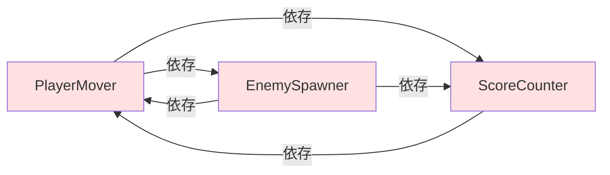
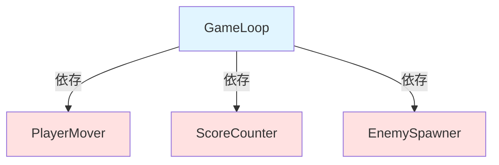
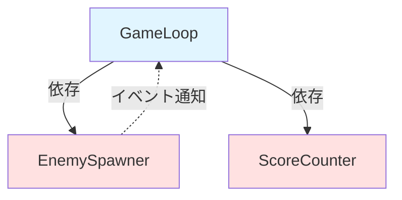

# 5. 依存の方向を制御する


神クラスを分割した後は、それによって生まれたクラスたちをどのように組み合わせるかが問題になります。ここで、安易に各クラス同士を参照させてしまうと依存関係がごちゃごちゃになり、せっかく神クラスを分割したのが無意味になります。



ここにおいて、制御フローを意識し、依存の方向が一方向に向くようにすることが重要です。

### 使う側と使われる側を意識する

依存の方向を整理する基本方針はシンプルです。使う側のクラスが使われる側のクラスを知り、使われる側のクラスは使う側のクラスを知らない。これだけです。

ここでいう使う側とは、複数のクラスを束ねて制御フロー全体を指揮するクラスです。使われる側のクラスは命令に従って自分の仕事だけを黙々とこなし、命令したのが誰であるかを知る必要はありません。

先の例でいえば、分割して生まれた `PlayerMover`、`ScoreCounter`、`EnemySpawner` はそれぞれ使われる側のクラスです。そして、それらを束ねてゲームの進行という制御フローを管理するクラスが必要になります。

```csharp=
// ✅ Good: 束ねるクラスが個々のクラスを使う
public class GameLoop : MonoBehaviour
{
    // 束ねる側は個々のクラスを知っている
    [SerializeField] PlayerMover playerMover;
    [SerializeField] EnemySpawner enemySpawner;
    ScoreCounter scoreCounter = new();

    void Start()
    {
        // 束ねる側が制御フローを組み立てる
        enemySpawner.OnEnemyDefeated += HandleEnemyDefeated;
    }

    // GameLoopのUpdateが唯一のエントリーポイント
    void Update()
    {
        playerMover.Move();
        enemySpawner.SpawnUpdate();
    }

    void HandleEnemyDefeated()
    {
        scoreCounter.AddScore(100);
    }
}
```



依存の方向が使う側から使われる側への一方向に揃いました。`PlayerMover`、`ScoreCounter`、`EnemySpawner` はお互いの存在を知りません。それぞれが自分の責務だけに集中し、それらを組み合わせて全体の制御フローを作るのは束ねる側の `GameLoop` の仕事です。このように、使う側と使われる側を意識するだけで依存関係はだいぶ整理されます。

### エントリーポイントを一つにする

プログラムにおいて一番最初に実行される場所、すなわち処理の開始地点のことをエントリーポイントといいます。pythonやC++でいうmain関数のことです。

unity文脈においては、MonoBehaviourの `Start()` や `Update()` などがエントリーポイントに相当します。これらのメソッドはUnityによって自動的に呼び出され、処理を実行する起点となります。

ここにおいて、エントリーポイントはあらゆる場所に置かず、一つの場所に集約するべきです。エントリーポイントは処理の起点であり、他のクラスに叩かれずとも自発的に動くことができます。つまり、あらゆるクラスの中でも一番上の使う側といえます。もしこれが複数存在すると、使う側と使われる側の関係が崩壊し、制御フローや依存関係が乱れてしまいます。「船頭多くして船山に登る」ということです。

エントリーポイントを一つにし、他のクラスはエントリーポイントに叩かれることで処理を行うようにしましょう。

### イベントを活用する

とはいっても、「敵が倒された」「プレイヤーが死んだ」「アイテムを拾った」など、使われる側のクラスから使う側のクラスに何かを通知したい場面は必ず出てきます。しかし使われる側が使う側に通知しようと参照を持ってメソッドを直接呼ぶのは相互依存になってしまいます。

ここで活躍するのがイベントです。イベントとは、ある出来事が発生したときにその発生を通知し、その通知を購読して処理を行う仕組みのことです。

```csharp=
// ✅ Good: イベントで通知する（使われる側は使う側を知らない）
public class EnemySpawner : MonoBehaviour
{
    [SerializeField] GameObject enemyPrefab;

    // 「敵が倒された」ことを通知するイベント
    public event Action OnEnemyDefeated;

    public void ReportEnemyDefeated()
    {
        // 誰が聞いているかは知らない。ただ通知するだけ。
        OnEnemyDefeated?.Invoke();
    }
}

// 束ねるクラスがイベントを購読して制御フローを組み立てる
public class GameLoop : MonoBehaviour
{
    [SerializeField] EnemySpawner enemySpawner;
    ScoreCounter scoreCounter = new();

    void Start()
    {
        // 束ねる側が「敵が倒されたらスコアを加算する」という制御フローを定義
        enemySpawner.OnEnemyDefeated += HandleEnemyDefeated;
    }

    void OnDestroy()
    {
        // オブジェクト破棄時にイベントの購読を解除する
        enemySpawner.OnEnemyDefeated -= HandleEnemyDefeated;
    }

    void HandleEnemyDefeated()
    {
        scoreCounter.AddScore(100);
    }
}
// → EnemySpawnerはScoreCounterの存在すら知らない
// → EnemySpawnerはGameLoopの存在すら知らない
// → 依存の方向は使う側から使われる側への一方通行を維持している
```



ここにおいて、イベントを通知する側は購読する側を知る必要がないという点が重要です。これはSNSに似ています。投稿者は何か出来事があったときにツイートしますが、その投稿を誰が読むか知りません。一方投稿を読みたい人は、垢をフォローするなり通知をつけるなりしてその人の投稿を購読します。もし新規投稿があれば通知され、後はそれに従って各々が反応するだけです。

ちなみに、イベントを購読するときに最も気をつけるべきことが、オブジェクトが破棄されたときなど、不要になったら必ず購読を解除することです。購読はたとえオブジェクトが破棄されても残り続けます。もしそのままだと、破棄済みのオブジェクトのメソッドが呼ばれてエラーが発生してしまいます。例えばMonoBehaviourの場合は `OnDestroy` で解除するのが基本です。

このように、イベントを活用することで依存関係を新たに生むことなく使われる側が使う側に通知することができるようになります。なお、ここでは例としてC#標準のイベントを使用しましたが、後に説明するR3を用いる方が便利でおすすめです。

