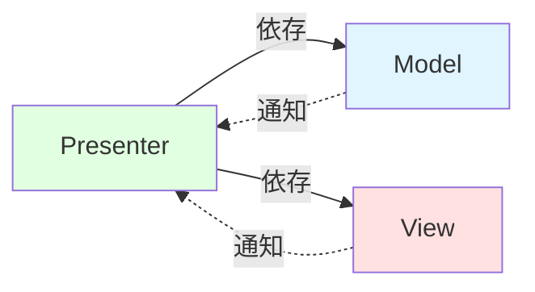
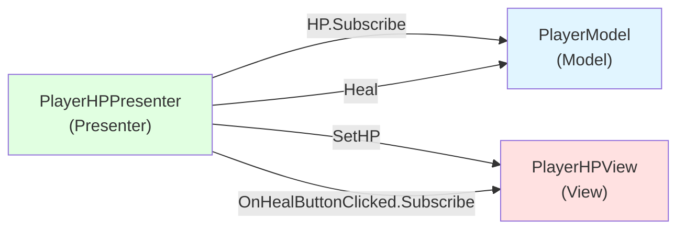

# 10. MV(R)PパターンでModelとViewを分離する


ゲームを成り立たせるためには、実際に画面に表示するオブジェクトやUIといったViewは欠かせません。そこで最後に、かの有名なMV(R)Pパターンを用いてViewの設計をスマートに行う方法を紹介します。

### Model/Viewとは

Modelとは、データの実体を持つオブジェクトのことです。例えば、プレイヤーの体力やステージの状態、残り制限時間などのデータを持つクラスはModelです。もう少し踏み込んだ表現をするなら、Modelはゲームの構成に必要不可欠な情報(ドメイン)を扱うオブジェクトです。

ゲームはこのModelのデータを画面に表示したり音声にしたりしてプレイヤーに伝え、プレイヤーから入力を受け取ることで進行します。このように、プレイヤーに情報を提示したり、入力を受け付ける部分、及びそれを管理するオブジェクトがViewです。回りくどい言い方をしましたが、早い話、ボタンやテキストなどのUI、3Dオブジェクト、BGM、キー入力などがViewです。たまにViewをUIと同一視している人がいますが、ViewはあくまでUIを含めたプレイヤーとゲームシステムを繋ぐ境界を指すのであってUIに限定されないことに注意してください。

### Viewの実装は難しい

今から紹介するのは、Viewをスマートに実装するための設計手法です。なぜViewだけを特別扱いするのかというと、Viewを設計するのは非常に難しいからです。Viewに表示するデータはその裏側で相互に連携し合っています。また、Viewを介してプレイヤーから入力を受け付ける必要もあり、更にそういったデータをリアルタイムで更新して画面に表示しなくてはいけません。このように、Viewはただでさえデータ構造が複雑になりがちな上に、リアルタイム性、インタラクション性が必要とされる場所なのです。そのため適当に実装してしまうと相互参照、循環参照、ビジーウェイト、イベントの無限ループ、などが簡単に発生してしまいます。

```csharp=
/// <summary>
/// UIとデータとごっちゃになったクラス
/// </summary>
public class Data : MonoBehaviour
{
    [SerializeField] Slider slider;

    // 外から読み書きされたりする
    public float CurrentValue { get; set; }

    void Update()
    {
        // Updateで無駄に値のチェックを毎フレームやってて最悪
        if (slider.value != CurrentValue)
        {
            slider.value = CurrentValue;
        }
    }

    // コード上では参照無いが、Sliderから呼び出されるpublicメソッド
    // Sliderと相互依存していてこの世の終わり
    public void OnSliderValueChanged()
    {
        CurrentValue = slider.value;
    }
}
```

更にViewはゲームの見た目も司っているため非常に変更されやすいです。実装がめちゃくちゃ複雑な上にめちゃくちゃ不安定。ただでさえModelは自分はゲームのロジックを管理するので忙しいのに、この厄介なViewを正確に更新することもしなくてはいけません。こんなの正直やってられません。

### MVPパターンとは

そこで、ModelがViewのことをいちいち気にしなくていいように両者を完全に分離してしまおう、という発想から生まれたのがMVPパターンです。これは簡単に言うと、ModelとViewを完全に分離し、間をPresenterと呼ばれるクラスで繋ぐ設計パターンです。

MVPパターンでは、View周りの構成要素を次の3つに分けて考えます。

- Model: データの実体。GUIとは直接関係ないアプリケーション本体の要素部分。
- View: GUIを制御する部分。データを画面に表示したり、逆にユーザからの操作を受け付ける部分。
- Presenter: ModelとViewをつなげる存在。仲介役。

MVPパターンで最も重要な点は、ModelとViewはお互いを全く知らないということです。つまりModelとViewは互いに全く依存せず、Presenterが存在しなければ、ViewとModelは完全に独立した状態になるということです。もちろんエラーも発生しません。

PresenterはModelとViewの代わりに双方の参照を持ち、両者の橋渡しを行います。Modelが変更されたらViewを更新し、Viewから入力を受けたらModelに反映させます。



これにより、ModelもViewも自分の本来の責務に専念でき、綺麗な設計になります。

さて、このMVPパターンですが、実際にコードとして実装しようとすると問題がでてきます。それは「ModelとViewをリアルタイムに連動させるにはどうしたらいいか」です。「Modelの変化をViewにすぐに反映する」「ユーザからのView入力をModelへ即座に伝える」という、リアルタイムな動作を何らかの方法を用いて実現する必要があるわけです。

そこで、次に紹介するR3を用いてMVPパターンをMVRPパターンへと進化させます。

### R3とは

R3はリアクティブプログラミングライブラリで、かの有名なUniRxの後継です。リアクティブプログラミングとは、値やイベントの変化に自動的に反応するプログラミングのパラダイムです。R3を使うことで、値の変更やイベントの通知をストリームとして扱い、それを購読・加工・合成する強力な仕組みが手に入ります。これはC#標準のイベント`event`/`Action`の上位互換的存在です。

#### Subject

R3の最も基本的な機能が `Subject<T>` です。これはC#標準の `event` に相当するもので、値を通知（発火）し、それを購読する仕組みを提供します。

```csharp=
using R3;

// Subjectはイベントの上位互換
Subject<string> onEnemyDefeated = new();

// Subscribe で購読する（event の += に相当）
onEnemyDefeated.Subscribe(enemyName =>
{
    Debug.Log($"{enemyName} を倒した！");
});

// OnNext で通知する（event の Invoke に相当）
onEnemyDefeated.OnNext("スライム");  // → "スライム を倒した！"
onEnemyDefeated.OnNext("ドラゴン");  // → "ドラゴン を倒した！"
```

#### オペレーター

「それなら `event Action<string>` と何が違うの？」と思うかもしれません。Subjectの本領はここからです。R3では通知をストリーム（流れ）として扱い、通知のストリームをLINQのように加工・変換・合成できます。これは標準イベントには無い機能で、複雑な通知ロジックを宣言的に記述できます。

```csharp=
ReactiveProperty<int> hp = new(100);

// Select: 値を変換する
hp.Select(v => (float)v / 100f)
    .Subscribe(ratio => slider.value = ratio);

// Where: 条件でフィルタリングする
hp.Where(v => v <= 0)
    .Subscribe(_ => Debug.Log("死亡！"));

// CombineLatest: 複数のストリームを合成する
ReactiveProperty<int> attack = new(10);
ReactiveProperty<int> buff = new(1);

attack.CombineLatest(buff, (atk, b) => atk * b)
    .Subscribe(totalAtk => Debug.Log($"攻撃力: {totalAtk}"));
```

#### ReactiveProperty

`ReactiveProperty<T>` は値を保持するクラスで、値が変更されたときに自動的に通知を発行するという性質を持っています。これはイベントの自動発火付きフィールドだと思えば分かりやすいでしょう。

```csharp=
using R3;

// ReactivePropertyは値を保持しつつ、変更時に自動通知する
ReactiveProperty<int> hp = new(100);

// Subscribe で変更を購読する（イベントの購読に相当）
hp.Subscribe(value =>
{
    Debug.Log($"HPが {value} に変わった！");
});

hp.Value = 80;  // → "HPが 80 に変わった！" と出力される
hp.Value = 50;  // → "HPが 50 に変わった！" と出力される
hp.Value = 50;  // → 同じ値なので通知されない！（重複排除）
```

外部には読み取り専用で公開したい場合は `ReadOnlyReactiveProperty<T>` として公開します。これにより、外部からは購読（読み取り）のみ可能で、値の書き換えはできなくなります。カプセル化の章で学んだ「setterを公開しない」原則をReactivePropertyでも守ることができるわけです。

```csharp=
public class PlayerModel
{
    // 内部では書き換え可能
    readonly ReactiveProperty<int> hp = new(100);

    // 外部には読み取り専用で公開（購読はできるが書き換えはできない）
    public ReadOnlyReactiveProperty<int> HP => hp;

    public void TakeDamage(int amount)
    {
        hp.Value = Mathf.Max(hp.Value - amount, 0); // 内部でのみ書き換え → 自動で通知が飛ぶ
    }
}
```

イベントの場合、`event Action<int> OnHPChanged` を定義し、値の変更箇所で都度 `OnHPChanged?.Invoke(value)` と書く必要がありました。`ReactiveProperty` を使えば、`.Value` に代入するだけで自動的に通知が発行されるのでこの手間がなくなります。さらに、同じ値を代入しても通知が発行されない重複排除の機能も標準で備わっています。

#### 購読の管理

購読の管理には `AddTo` を使います。これによって購読をMonoBehaviourのライフサイクルに紐づけることができ、購読の解除忘れによるバグを防げます。

```csharp=
// MonoBehaviourのライフサイクルに紐付けて自動解除
hp.Subscribe(value =>
{
    slider.value = (float)value / maxHP;
}).AddTo(this); // ← thisが破棄されたら自動で購読解除
```

### MVPからMV(R)Pへ

この `ReactiveProperty` をMVPパターンに組み合わせたものが、MV(R)Pパターンです。Presenterが `ReactiveProperty` を購読してModelの変更を検知し、それをViewに反映する。逆にViewからの入力もPresenterが受け取ってModelに伝える。このようにModelとViewの橋渡しをリアクティブな仕組みで行います。

```csharp=
using R3;
using UnityEngine;

/// <summary>
/// プレイヤーのModel
/// HPの管理だけに専念する。UIのことは一切知らない。
/// </summary>
public class PlayerModel : MonoBehaviour
{
    readonly ReactiveProperty<int> hp = new(100);

    // 外部には読み取り専用で公開
    public ReadOnlyReactiveProperty<int> HP => hp;
    public int MaxHP => 100;

    void OnCollisionEnter(Collision collision)
    {
        // 敵に触れたらダメージ
        if (collision.gameObject.TryGetComponent<Enemy>(out _))
        {
            hp.Value = Mathf.Max(hp.Value - 10, 0);
        }
    }

    // 回復する — 誰がいつ呼ぶかは知らない
    public void Heal(int amount)
    {
        hp.Value = Mathf.Min(hp.Value + amount, MaxHP);
    }

    void OnDestroy()
    {
        hp.Dispose();
    }
}
// → PlayerModelはSliderやButtonの存在を知らない
// → 「回復ボタンが押されたから回復する」ではなく「回復しろと命じられたから回復する」
// → 純粋にゲームロジックだけに集中している
```

```csharp=
using System;
using R3;
using UnityEngine;
using UnityEngine.UI;

/// <summary>
/// HPバーと回復ボタンのView
/// 値を受け取って表示し、ボタンの入力を通知するだけ。
/// データがどこから来るか、ボタンを押したら何が起きるかは知らない。
/// </summary>
public class PlayerHPView : MonoBehaviour
{
    [SerializeField] Slider slider;
    [SerializeField] Text label;
    [SerializeField] Button healButton;

    // ボタンが押されたことを通知するObservable
    // Viewは「ボタンが押された」という事実を通知するだけで、その結果何が起きるかは知らない
    public Observable<Unit> OnHealButtonClicked =>
        healButton.OnClickAsObservable();

    // 呼ばれたら表示を更新するだけ
    public void SetHP(int current, int max)
    {
        slider.value = (float)current / max;
        label.text = $"{current} / {max}";
    }
}
// → PlayerHPViewはPlayerModelの存在を知らない
// → ボタンが押されたら何が起きるかも知らない
// → ただ「表示する」「入力を通知する」だけ
```

```csharp=
using R3;
using UnityEngine;

/// <summary>
/// PlayerのHPに関するPresenter
/// ModelとViewの両方を知っている唯一の存在
/// </summary>
public class PlayerHPPresenter : MonoBehaviour
{
    // Model
    [SerializeField] PlayerModel playerModel;

    // View
    [SerializeField] PlayerHPView playerHPView;

    void Start()
    {
        // Model → View: HPが変わったらViewを更新
        playerModel.HP.Subscribe(hp =>
        {
            playerHPView.SetHP(hp, playerModel.MaxHP);
        }).AddTo(this);

        // View → Model: 回復ボタンが押されたらModelに回復を命じる
        playerHPView.OnHealButtonClicked.Subscribe(_ =>
        {
            playerModel.Heal(30);
        }).AddTo(this);
    }
}
// → Presenterは薄い橋渡し役。ロジックも状態も持たない
// → 「HPが変わったらViewを更新する」「ボタンが押されたらModelに命じる」だけ
// → Presenterを外してもPlayerModelは正常に動くし、PlayerHPViewも壊れない
// → ただ画面に表示されなくなり、ボタンを押しても何も起きなくなるだけ
```



- Model → View: `PlayerModel` のHPが変化すると、`ReactiveProperty` の通知がPresenterに届き、PresenterがViewの `SetHP` を呼んで画面を更新する
- View → Model: 回復ボタンが押されると、Viewの `OnHealButtonClicked` がPresenterに通知し、PresenterがModelの `Heal` を呼んで回復する

このように、リアクティブな仕組みによってModelをどのように変更してもその変更がViewにリアルタイムで伝わり、Modelと同期されることが保証されます。そうなるとModel側はViewのことは完全に気にすることなく、自分の責務に専念することができます。これが本当に嬉しいのです。

### MV(R)Pパターンで守るべきこと

ここで注意してほしいのが、Presenterは可能な限り薄くするべきということです。PresenterはあくまでModelとViewの仲介役であり、やることはせいぜい、値を適切に加工してModelやViewのメソッドを叩くことです。よって、Presenterにはゲームのロジックを絶対に持たせてはいけませんし、UIの詳細な表示ロジックも持たせてはいけません。

MV(R)Pパターンを組む上で重要な点をまとめます。

- ModelはViewを知らない
    - Modelはゲームロジックとデータの管理に専念します。UIの存在を一切知りません。
- ViewはModelを知らない
    - Viewは与えられた値の表示と入力の受付に専念します。データがどこから来るかは知りません。
- Presenterは薄くする
    - Presenterの責務はModelとViewの橋渡しだけです。ゲームロジック（Modelの責務）やUIの表示制御（Viewの責務）を持たせてはいけません。データの型変換や値の範囲補正など、仲介に必要な最低限の処理のみに留めましょう。
- Presenterが無くてもModelは動く
    - Presenterを取り除いてもModelのロジックはエラーなく動作するべきです。画面に表示されなくなるだけです。これが、ModelがViewに依存していないことの証拠です。

### MV(R)Pパターンが言っていること/言ってないこと

こういう設計パターンを用いる際に気をつけるべきこととして、「この設計パターンは何を語っているのか」です。たまに深読して、本来の意味とは全く違うことを豪語する人が居たりするので注意が必要です。

#### 言っていること

- View周りの実装パターンである
- ViewとModelを「Presenter」という薄いレイヤでつなごう
- 各オブジェクトの連結にはObservable(ReactiveProperty)を活用しよう

#### 言っていないこと

- MonoBehaviourを継承したクラスは全てViewである
    - MV(R)PパターンはMonoBehaviourの有無について語っていません。綺麗に実装できるならそこは自由にやって良いです
- ModelはPure C#で書かなければならない
    - 同上
- MV(R)Pパターンを使えばゲームを何でもキレイに実装できる
    - MV(R)Pパターンは銀の弾丸ではないです

