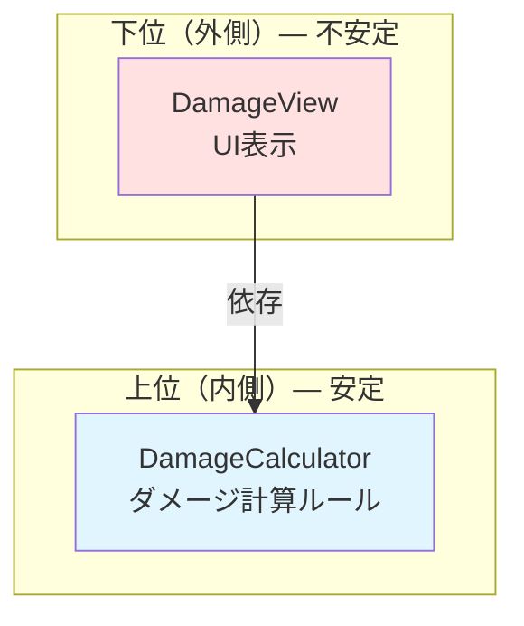
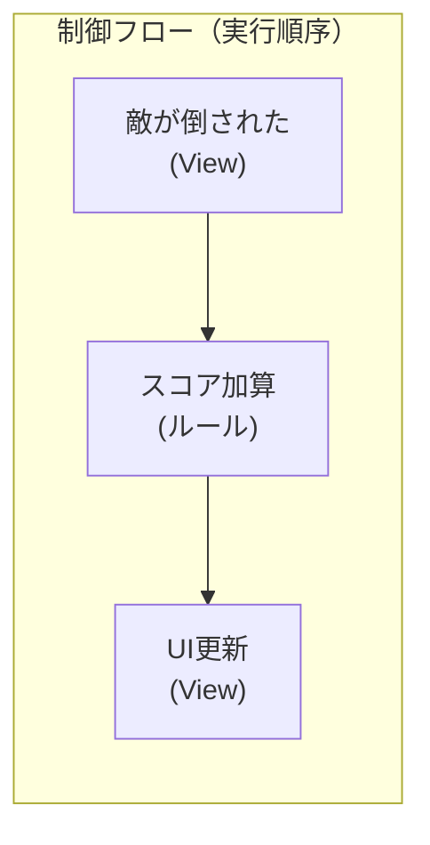
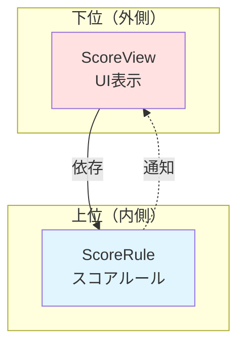

# 3. Clean Architecture


アーキテクチャを考えるうえで最も重要な指針となるのがClean Architectureです。これはとても有名な概念で様々な場所で取り上げられていますが、残念ながら多くの人が誤って解釈してしまっています。ここでは原典に従った正しい説明を行います。

### Clean Architectureとは

Clean Architectureとは、SOLID原則やClean Codeでお馴染みのRobert C. Martinが提唱した概念及びその書籍です。Clean Architectureでは、この世界に存在する様々なアーキテクチャに共通するルールを見出し、「こう設計すれば上手くいきがちだよね」という指針を提示しています。

Clean Architectureが主張していることは以下の2点です。

- 依存関係は上位レベルに向けて一方通行にすること
- 制御フローと依存関係を分離すること

### 依存関係を上位レベルに向けて一方通行にする

第2回の依存性逆転の原則で取り上げた上位/下位の概念を思い出してください。上位とはゲームの本質的かつ抽象的なルールや方針、下位はその具体的な実装です。Clean Architectureが述べる1つ目の主張は、この上位/下位の概念をプロジェクト全体に適用し、依存関係を常に上位レベルに向けて一方通行にせよということです。

> ソースコードの依存性は、内側に向かってのみ向けなければならない。
>
> (Source code dependencies must point only inward, toward higher-level policies.)
>
> Robert C. Martin

Clean Architectureでは、上位のコンポーネントを内側に、下位を外側に置いた同心円状の図を構築し、依存の方向が中心(上位)に向かって一方通行になるようにするべきだと説明しています。


ゲーム開発を例にすると、以下のようにレベルを分けることができます。

|   レベル   | 内容                                                           | 安定性 |
| :--------: | :------------------------------------------------------------- | :----: |
| 高（内側） | ダメージ計算、ターン進行、勝敗判定などのゲームの本質的なルール |  安定  |
|     ↕      | 入力に応じてキャラクターを動かす、敵をスポーンさせるなどの制御 |   ↕    |
| 低（外側） | UI表示、アニメーション、SE再生、セーブ方法などの技術的な詳細   | 不安定 |

この構造において、上位レベルが下位レベルに依存してしまうと何が起きるでしょうか。例えば、ダメージ計算ロジックが特定のUIコンポーネントに依存していたら、UIを変更するだけでダメージ計算のコードまで修正しなくてはいけなくなります。本来安定しているはずのゲームの本質的なルールが、不安定な詳細に引きずられて壊れてしまうのです。

```csharp=
// ❌ Bad: ゲームの本質的なルール（上位）がUI（下位）に依存している
public class DamageCalculator
{
    [SerializeField] Text damageText; // UIへの直接依存！

    public int Calculate(int attack, int defense)
    {
        int damage = Mathf.Max(attack - defense, 0);
        damageText.text = damage.ToString(); // ダメージ計算とUI表示が混在
        return damage;
    }
}
// → UIを変更するとダメージ計算のコードも修正が必要になる
// → ダメージ計算をUI無しでテストできない
// → 本来安定しているはずのロジックが、不安定なUIに振り回される
```

```csharp=
// ✅ Good: 依存関係が上位レベルに向いている
// 上位: ゲームのルール — UIの存在を知らない
public class DamageCalculator
{
    public int Calculate(int attack, int defense)
    {
        return Mathf.Max(attack - defense, 0);
    }
}

// 下位: UI表示 — 上位のDamageCalculatorを知っている
public class DamageView : MonoBehaviour
{
    [SerializeField] Text damageText;
    [SerializeField] DamageCalculator calculator;

    public void ShowDamage(int attack, int defense)
    {
        int damage = calculator.Calculate(attack, defense);
        damageText.text = damage.ToString();
    }
}
// → UIをどれだけ変更してもDamageCalculatorは無傷
// → DamageCalculatorはUI無しでもテスト可能
```



このように、依存関係が常に安定した上位に向かって一方通行に流れるようにする。これがClean Architectureの依存性のルールです。これは依存性逆転の原則をプロジェクト全体のスケールで適用したものだと言えます。

### 制御フローと依存関係を分離する

2つ目の主張は、制御フローと依存関係は別物であり、これらを分けて考えよということです。

制御フローとは、プログラムの処理が実際に実行される順序・方向のことです。例えば「プレイヤーが攻撃ボタンを押す → 攻撃処理が実行される → ダメージが計算される → UIが更新される」という一連の流れが制御フローです。

一方、依存関係とはコードの参照方向のことです。あるクラスが別のクラスの型を知っている、メソッドを呼んでいる、インスタンスを持っている、といった関係です。

ここで重要なのは、制御フローの方向と依存関係の方向は必ずしも一致しないということです。制御フローが A → B → C と流れていても、依存関係が同じ方向とは限りません。先程の依存性のルールに従えば、依存関係は常に上位レベルに向くべきですが、制御フローは上位から下位に向かうこともあれば、下位から上位に向かうこともあります。

例えば、こういう場面を考えてみましょう。ゲームの制御フローとして「敵が倒された → スコアが加算される → UIが更新される」という流れがあるとします。制御フローは「View（敵の撃破検知）→ ルール（スコア加算）→ View（UI更新）」のように、外側から内側へ、そしてまた外側へ流れます。



もしこの制御フローをそのまま依存関係にしてしまうと、上位のスコアルールが下位のViewに依存してしまい、依存性のルールに違反します。

```csharp=
// ❌ Bad: 制御フローと依存関係を一致させてしまった
public class ScoreRule
{
    ScoreView scoreView; // 上位が下位に依存している！

    public void AddScore(int amount)
    {
        score += amount;
        scoreView.UpdateDisplay(score); // ルールがUIを直接呼んでいる
    }
}
// → 制御フロー: ScoreRule → ScoreView ✅
// → 依存関係: ScoreRule → ScoreView ❌ (上位が下位に依存)
```

ここで活躍するのが第2回で学んだインターフェースやイベントです。制御フローの方向を維持しながら、依存関係の方向を逆転させることができます。

```csharp=
// ✅ Good: 制御フローと依存関係が分離されている
public class ScoreRule
{
    ReactiveProperty<int> score = new(0);
    public ReadOnlyReactiveProperty<int> Score => score;

    public void AddScore(int amount)
    {
        score.Value += amount;
        // UIの存在を知らない。通知するだけ。
    }
}

public class ScoreView : MonoBehaviour
{
    [SerializeField] Text scoreText;
    [SerializeField] ScoreRule scoreRule; // 下位が上位に依存 ✅

    void Start()
    {
        scoreRule.Score.Subscribe(value =>
        {
            scoreText.text = $"Score: {value}";
        }).AddTo(this);
    }
}
// → 制御フロー: ScoreRule → (通知) → ScoreView（スコアが変わる→表示が更新される）
// → 依存関係: ScoreView → ScoreRule（ViewがRuleを知っている。逆ではない）
// → 制御フローと依存関係の方向が異なっている！
```



制御フローの方向は `ScoreRule` → `ScoreView` です（スコアが変わると表示が更新される）。しかし依存関係の方向は `ScoreView` → `ScoreRule` です（ViewがRuleを知っていて、Ruleの変更を購読している）。制御フローと依存関係が逆方向になっています。

これこそが「制御フローと依存関係を分離する」ということです。制御フローがどの方向に流れようとも、依存関係は常に上位レベルに向けることができる。そのために、イベントやインターフェースなどの仕組みを活用して、制御フローの方向に縛られない依存関係を設計するのです。

依存性逆転の原則は、まさにこの分離を実現するための手段でした。インターフェースを挟むことで、制御フローは変えずに依存関係だけを逆転させる。Clean Architectureはこの原則をアーキテクチャ全体に適用することを求めているのです。

### Clean Architectureに関する誤解

世間には以下のような誤った言説が出回っています。

- Clean Architectureというアーキテクチャが存在する
    - 存在しません。Clean Architectureは設計の指針を示しただけであり、具体的なアーキテクチャについては言及していません。
- 例の図の通りにレイヤーやコンポーネントを構成するべき
    - 誤りです。あの図はあくまでClean ArchitectureをWebで実践するならこういうやり方もあるという一例を示しただけであり、それに従う理由は一切ありません。

