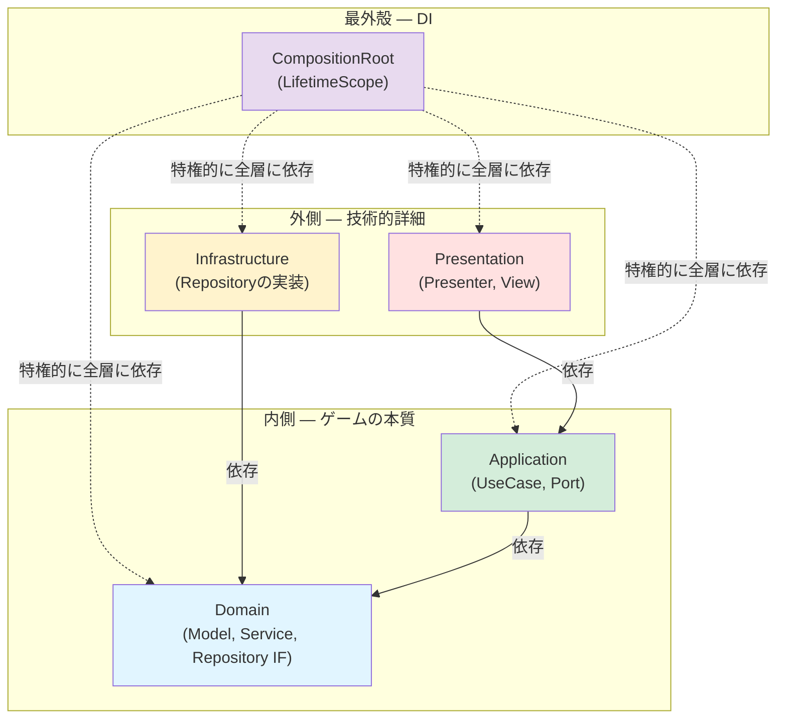
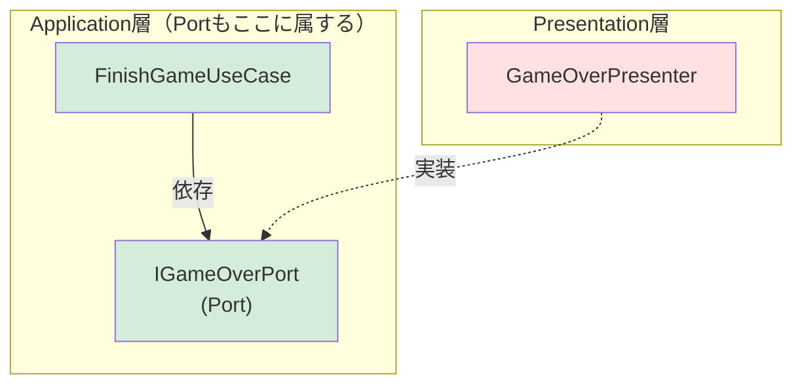
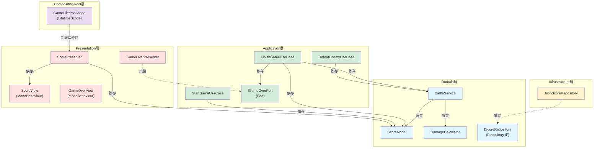

# 7. 例) オニオンアーキテクチャ


では実際にこれまでに紹介した内容を用いて具体的なアーキテクチャを組んでみましょう。ここでは例としてオニオンアーキテクチャを取り上げます。これは私が最近Unityで開発するときに使用しているアーキテクチャです。あくまで例の一つであり、採用するアーキテクチャはプロジェクトによって異なることを念頭に、参考程度に見てください。

### オニオンアーキテクチャとは

オニオンアーキテクチャとは、Clean Architectureの同心円の考え方を具体的なレイヤー構造に落とし込んだアーキテクチャの一つです。名前の通り玉ねぎのような同心円状のレイヤー構造を持ち、内側ほど安定した本質的なルール、外側ほど技術的な詳細を担います。依存関係は常に内側に向き、外側の変更が内側に影響しないようにします。

オニオンアーキテクチャはWeb開発のバックエンドなどでも使用されているアーキテクチャで、Unityにおいてはアウトゲーム部分と特に相性が良いです。どこに何を書けば良いかが明確で、機能追加や修正にめちゃくちゃ強く、テストも書きやすいのがメリットです。逆に、使いこなすには相応の知識が求められることと、インゲームには若干適用しにくさがあるのがデメリットです。しかしインゲームが全く書けないわけではなく、パズルゲームや音ゲーなど、Unity固有の機能に深く依存しないゲームであれば相性はかなり良いです。


ここでは、Unityにおける実際の開発に合わせて各クラスを以下の5つのレイヤーに分けます。

|    レイヤー     |  位置  | 役割                                       | 構成要素                         |
| :-------------: | :----: | :----------------------------------------- | :------------------------------- |
|     Domain      | 最内殻 | ゲームの本質的なルールやデータ構造         | Model, Service, Repository（IF） |
|   Application   |  内側  | ゲームの具体的な進行・手順                 | UseCase, Port（IF）              |
|  Presentation   |  外側  | UIやユーザー入力の処理                     | Presenter, View                  |
| Infrastructure  |  外側  | セーブ、通信、外部サービスなどの技術的詳細 | Repositoryなどの実装             |
| CompositionRoot | 最外殻 | 全レイヤーのDI                             | LifetimeScope                    |



### Domain層

Domain層は最も内側のレイヤーであり、ゲームの本質的なルールやデータ構造を定義します。ドメインとは、「そのシステムが解決しようとしている、現実世界のテーマや業務領域」のことです。つまりUnity文脈に当てはめると、「そのゲームの根幹となるルールや知識」ということになります。

Domain層は最も内側なので他のどのレイヤーにも依存しません。UIがどうなっているか、データがどこに保存されるかといったことは一切知りません。

#### Model

ドメインモデルであり、ゲームの本質的なルールやデータを持つクラスです。スコア、HP、ダメージ計算など、ゲームのルールやビジネスロジック表現します。

```csharp=
// Domain層 - Model: ゲームの本質的なルールとデータ
public class ScoreModel
{
    readonly ReactiveProperty<int> score = new(0);
    public ReadOnlyReactiveProperty<int> Score => score;

    public void Add(int amount)
    {
        if (amount < 0) throw new ArgumentException("スコアは負の値を加算できない");
        score.Value += amount;
    }

    public void Reset()
    {
        score.Value = 0;
    }

    public void Dispose()
    {
        score.Dispose();
    }
}

public class DamageCalculator
{
    public int Calculate(int attack, int defense)
    {
        return Math.Max(attack - defense, 0);
    }
}
// → Unityを知らない。UIを知らない。セーブ方法を知らない。
// → 「ゲームのルール」だけを純粋に表現している
```

#### Service

ドメインサービスです。複数のModelにまたがる処理や、単一のModelに属さない複雑なドメインロジックを担うクラスです。例えば、ダメージ計算の結果をスコアに反映する処理は、`DamageCalculator` と `ScoreModel` の両方にまたがるため、ドメインサービスとして切り出すことができます。

```csharp=
// Domain層 - Service: 複数のModelにまたがるドメインロジック
public class BattleService
{
    readonly DamageCalculator damageCalculator;
    readonly ScoreModel scoreModel;

    public BattleService(DamageCalculator damageCalculator, ScoreModel scoreModel)
    {
        this.damageCalculator = damageCalculator;
        this.scoreModel = scoreModel;
    }

    public void ProcessEnemyDefeat(int playerAttack, int enemyDefense)
    {
        int damage = damageCalculator.Calculate(playerAttack, enemyDefense);
        scoreModel.Add(damage * 10);
    }
}
// → DamageCalculatorとScoreModelの両方を使う処理
// → どちらか一方のModelに押し込むと不自然になる処理を担う
```

#### Repository

データの永続化（セーブやロード）に関するRepositoryパターンのインターフェースです。「データをどう保存するか」という具体的な方法は知らず、その契約だけを定義します。実装はInfrastructure層に任せます。

```csharp=
// Domain層 - Repository: 永続化の契約（インターフェースのみ）
public interface IScoreRepository
{
    void Save(int score);
    int Load();
}
// → 「スコアを保存・読み込みできる」という契約だけ
// → JSON? PlayerPrefs? サーバー? それはDomainの関心ではない
```

### Application層

Application層は、Domain層のオブジェクトを組み合わせてユースケースを記述する層です。ユースケースとは、「ユーザーがシステムを用いて達成したい事柄」のことです。例えば、ボタンのUIを押したとき、ユーザーは何がしたいのか？キー入力をしたとき、ユーザーは何がしたいのか？そういったこと一つ一つがユースケースです。

#### UseCase

ユースケースを記述するクラスです。Domain層のオブジェクトを組み合わせてユースケースを作ります。ここにおいて、UseCaseの中にはビジネスロジックを記述しません。ビジネスロジックはDomain層に記述し、UseCaseはそのメソッドを叩くだけです。1クラス1メソッド（`Execute`）が理想で、クラス名はそのユースケースが何をするかを明確に表す名前にします。

```csharp=
// Application層 - UseCase

// 「敵を倒す」ユースケース
public class DefeatEnemyUseCase
{
    readonly BattleService battleService;

    public DefeatEnemyUseCase(BattleService battleService)
    {
        this.battleService = battleService;
    }

    public void Execute(int playerAttack, int enemyDefense)
    {
        battleService.ProcessEnemyDefeat(playerAttack, enemyDefense);
    }
}

// 「ゲームを開始する」ユースケース
public class StartGameUseCase
{
    readonly ScoreModel scoreModel;

    public StartGameUseCase(ScoreModel scoreModel)
    {
        this.scoreModel = scoreModel;
    }

    public void Execute()
    {
        scoreModel.Reset();
    }
}

// 「ゲームを終了する」ユースケース
public class FinishGameUseCase
{
    readonly IGameOverPort gameOverPort;
    readonly ScoreModel scoreModel;

    public FinishGameUseCase(
        IGameOverPort gameOverPort,
        ScoreModel scoreModel)
    {
        this.gameOverPort = gameOverPort;
        this.scoreModel = scoreModel;
    }

    public void Execute()
    {
        // Portを通じてPresentation層にゲームオーバー画面の表示を要求する
        gameOverPort.ShowGameOverScreen(scoreModel.Score.CurrentValue);
    }
}
// → 各UseCaseは1つのExecuteメソッドだけを持つ
// → クラス名を見ればそのUseCaseが何をするか分かる
// → ビジネスロジックはDomain層に任せ、UseCaseはそれを組み合わせるだけ
```

#### Port

Portは、Application層からPresentation層のPresenterにアクセスするためのインターフェースです。

Viewの更新を全てリアクティブに行うことができれば理想的なのですが、現実のゲーム開発においては、Web開発などの他の開発と比べてViewが非常に大きな意味を持っています。故に、UseCaseが明示的にViewを扱いたい場面というのはよくあります。

そこで、Application層にPresenterへのインターフェースを定義し、Presentation層のPresenterがそれを実装します。こうすることで、依存の方向を保ったままUseCaseがViewに干渉できるようになります。

```csharp=
// Application層 - Port: Presenterへのインターフェース
public interface IGameOverPort
{
    void ShowGameOverScreen(int finalScore);
}
// → Application層が定義するインターフェース
// → 「ゲームオーバー画面を表示できる何か」という抽象
// → 具体的なUIの見た目や演出はPresentation層の関心
```



### Presentation層

Presentation層は、ユーザーとシステムの境界を扱います。すなわち、ViewとPresenterです。

#### View

UIの表示やユーザー入力の受け取りを担う。GameObjectやUIコンポーネントにアクセスする必要があるため、MonoBehaviourの継承を許可します。

```csharp=
// Presentation層 - View: UIの表示（MonoBehaviourを使う唯一の場所）
public class ScoreView : MonoBehaviour
{
    [SerializeField] Text scoreText;

    public void SetScore(int score)
    {
        scoreText.text = $"Score: {score}";
    }
}

public class GameOverView : MonoBehaviour
{
    [SerializeField] GameObject gameOverPanel;
    [SerializeField] Text finalScoreText;

    public void Show(int finalScore)
    {
        gameOverPanel.SetActive(true);
        finalScoreText.text = $"Final Score: {finalScore}";
    }
}
```

#### Presenter

Application層とViewの橋渡しを担います。

```csharp=
// Presentation層 - Presenter: Pure C#で書く（MonoBehaviourは使わない）

// スコア表示のPresenter — リアクティブでUIを自動更新
public class ScorePresenter : IStartable, IDisposable
{
    readonly ScoreModel scoreModel;
    readonly ScoreView scoreView;
    readonly CompositeDisposable compositeDisposable = new();

    public ScorePresenter(ScoreModel scoreModel, ScoreView scoreView)
    {
        this.scoreModel = scoreModel;
        this.scoreView = scoreView;
    }

    public void Start()
    {
        // ReactivePropertyをSubscribeしてUIを自動更新
        scoreModel.Score.Subscribe(score =>
        {
            scoreView.SetScore(score);
        }).AddTo(compositeDisposable);
    }

    public void Dispose()
    {
        compositeDisposable.Dispose();
    }
}

// ゲームオーバーのPresenter — PortでUseCaseから直接呼ばれる
public class GameOverPresenter : IGameOverPort
{
    readonly GameOverView gameOverView;

    public GameOverPresenter(GameOverView gameOverView)
    {
        this.gameOverView = gameOverView;
    }

    // IGameOverPortの実装 — UseCaseから明示的に呼ばれる
    public void ShowGameOverScreen(int finalScore)
    {
        gameOverView.Show(finalScore);
    }
}
// → ScorePresenterはリアクティブ（Subscribe）でUIを更新
// → GameOverPresenterはPort（IGameOverPort）でUseCaseから直接呼ばれる
// → どちらもPure C#。MonoBehaviourはViewだけ。
```

### Infrastructure層

Infrastructure層は、Domain層で定義されたRepositoryインターフェースの具体的な実装を担います。

```csharp=
// Infrastructure層: Domain層のIScoreRepositoryを実装する
public class JsonScoreRepository : IScoreRepository
{
    readonly string filePath;

    public JsonScoreRepository(string filePath)
    {
        this.filePath = filePath;
    }

    public void Save(int score)
    {
        var data = new ScoreSaveData { score = score };
        string json = JsonUtility.ToJson(data);
        File.WriteAllText(filePath, json);
    }

    public int Load()
    {
        if (!File.Exists(filePath)) return 0;
        string json = File.ReadAllText(filePath);
        var data = JsonUtility.FromJson<ScoreSaveData>(json);
        return data.score;
    }

    [Serializable]
    struct ScoreSaveData
    {
        public int score;
    }
}
// → IScoreRepositoryを実装しているだけ
// → セーブ方法を変えたい？ このクラスを差し替えるだけでOK
// → Domain層やApplication層のコードは一切変更不要
```

### CompositionRoot層

CompositionRoot層は、全てのレイヤーのクラスを知り、インスタンスの生成とDIを担う特別な層です。VContainerの `LifetimeScope` がこの役割を果たします。

CompositionRoot層は**特権的に全てのレイヤーに依存します**。通常、依存関係は内側にしか向けられませんが、CompositionRoot層だけはこのルールの例外です。全てのクラスを知ってDIを組み立てるためには、全層を参照する必要があるからです。

```csharp=
// CompositionRoot層: 全レイヤーに依存する特権的な層
using VContainer;
using VContainer.Unity;

public class GameLifetimeScope : LifetimeScope
{
    [SerializeField] ScoreView scoreView;
    [SerializeField] GameOverView gameOverView;

    protected override void Configure(IContainerBuilder builder)
    {
        // Domain層
        builder.Register<DamageCalculator>(Lifetime.Singleton);
        builder.Register<ScoreModel>(Lifetime.Singleton);
        builder.Register<BattleService>(Lifetime.Singleton);

        // Application層
        builder.Register<DefeatEnemyUseCase>(Lifetime.Singleton);
        builder.Register<StartGameUseCase>(Lifetime.Singleton);
        builder.Register<FinishGameUseCase>(Lifetime.Singleton);

        // Presentation層
        builder.RegisterComponent(scoreView);
        builder.RegisterComponent(gameOverView);
        builder.RegisterEntryPoint<ScorePresenter>();
        // PortのDI: IGameOverPortを要求されたらGameOverPresenterを注入する
        builder.Register<GameOverPresenter>(Lifetime.Singleton).As<IGameOverPort>();

        // Infrastructure層
        builder.Register<JsonScoreRepository>(Lifetime.Singleton)
            .WithParameter("filePath", "save.json")
            .As<IScoreRepository>();
    }
}
// → 全レイヤーのクラスを登録し、依存関係を組み立てる
// → PortやRepositoryのインターフェースと実装の紐付けはここで行う
// → この層だけが全レイヤーを知ることが許される
```

### レイヤー間の依存関係

全体の依存関係を確認してみましょう。



全ての依存関係が内側（上位）に向かって一方通行になっていることが分かります。

